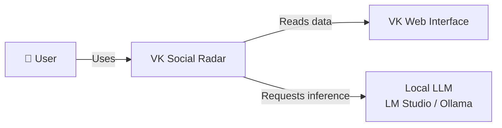
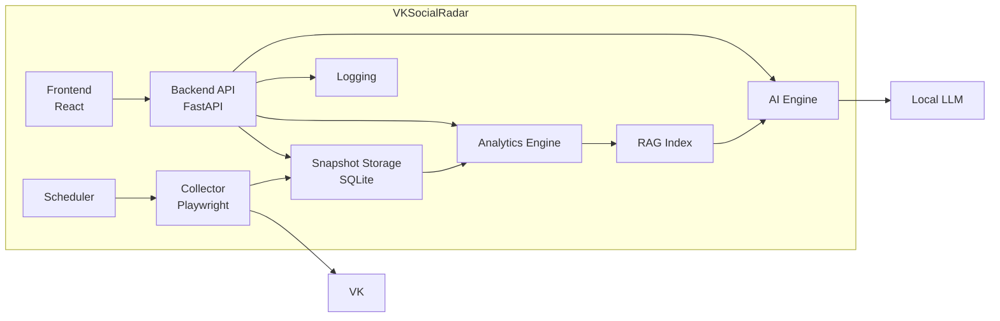
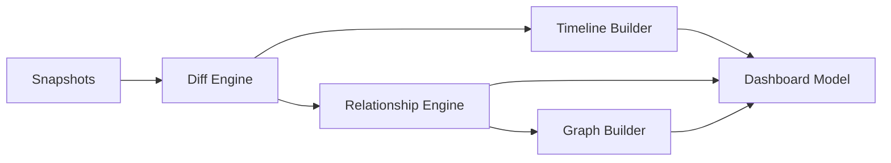
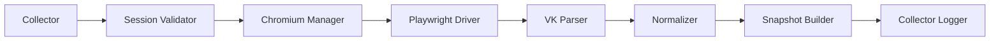
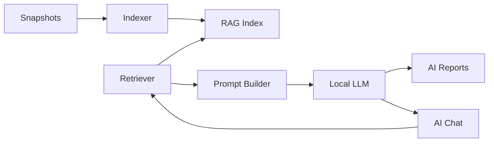
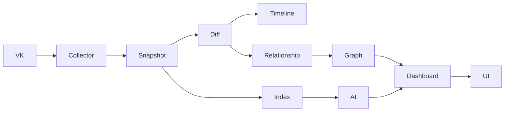

> **Architecture status: TARGET / EVOLUTIONARY DESIGN.**
> This document describes intended architecture and is not evidence that every component is implemented.
> Verified AS-IS: [docs/certification/C4_CURRENT.md](docs/certification/C4_CURRENT.md).
> Implementation status: [docs/certification/ARCHITECTURE_STATUS.md](docs/certification/ARCHITECTURE_STATUS.md).

# 08_SYSTEM_ARCHITECTURE.md

# System Architecture

**Project:** VK Social Radar  
**Version:** 1.0  
**Status:** Draft

---

# Purpose

Документ описывает архитектуру системы VK Social Radar на уровне C4 Model.

Используются три уровня представления:

1. Context Diagram
2. Container Diagram
3. Component Diagram

Данный документ не описывает внутренние алгоритмы. Они вынесены в специализированные документы:

- Collector Architecture
- AI Architecture
- RAG Architecture
- Database Schema
- Data Model

---

# Architecture Principles

Система строится на следующих принципах.

## Local First

Все данные пользователя обрабатываются исключительно локально.

---

## Privacy First

Персональные данные не передаются во внешние сервисы.

---

## Snapshot First

Единственным источником истины является Snapshot.

Ни один аналитический модуль не обращается напрямую к VK.

---

## AI Native

ИИ является отдельным компонентом архитектуры и использует только локальные данные.

---

## Modular Design

Каждый модуль имеет одну ответственность.

---

# C4 Level 1 — Context Diagram

## Назначение

Показывает место системы среди внешних участников.

---

## Actors

### User

Основной пользователь системы.

Использует интерфейс приложения.

---

### VK Web Interface

Источник данных.

Используется только Collector.

---

### Local LLM

Выполняет AI-анализ.

Используется AI Engine.

---

# C4 Level 2 — Container Diagram

## Назначение

Показывает основные контейнеры приложения.

---

# Container Responsibilities

## Frontend

Отвечает за:

- Dashboard;
- Timeline;
- Social Graph;
- Snapshot Browser;
- AI Chat;
- настройки приложения.

---

## Backend API

Является оркестратором системы.

Функции:

- REST API;
- управление жизненным циклом приложения;
- взаимодействие между контейнерами.

---

## Collector

Получает данные из VK.

Не содержит бизнес-логики.

---

## Scheduler

Запускает периодический сбор данных.

---

## Snapshot Storage

Хранит:

- Snapshot;
- историю Snapshot;
- служебные данные.

Является единственным постоянным хранилищем системы.

---

## Analytics Engine

Вычисляет производные данные.

Не взаимодействует с VK.

---

## RAG Index

Строит индекс для AI.

---

## AI Engine

Выполняет:

- AI Analyst;
- AI Chat;
- генерацию отчетов.

---

## Logging

Хранит:

- технические логи;
- ошибки;
- диагностику.

---

# C4 Level 3 — Component Diagram

## Analytics Container

---

## Component Responsibilities

### Diff Engine

Ответственность

- сравнение Snapshot;
- определение изменений.

---

### Timeline Builder

Ответственность

Построение временной истории объектов.

---

### Relationship Engine

Ответственность

Расчет Relationship Score и связанных метрик.

---

### Graph Builder

Ответственность

Построение социального графа.

---

### Dashboard Model

Ответственность

Подготовка агрегированных данных для пользовательского интерфейса.

---

# Collector Components

---

## Component Responsibilities

### Session Validator

Проверяет наличие действующей пользовательской сессии.

---

### Chromium Manager

Управляет отдельным Chromium Profile.

---

### Playwright Driver

Автоматизирует работу браузера.

---

### VK Parser

Извлекает данные из DOM.

---

### Normalizer

Преобразует HTML в доменную модель.

---

### Snapshot Builder

Создает Snapshot.

---

### Collector Logger

Фиксирует процесс выполнения Collector.

---

# AI Components

---

## Component Responsibilities

### Indexer

Создает индекс локальной базы знаний.

---

### RAG Index

Хранит индекс и обеспечивает поиск.

---

### Retriever

Извлекает релевантный контекст.

---

### Prompt Builder

Формирует системный промпт.

---

### AI Reports

Создает аналитические отчеты.

---

### AI Chat

Отвечает на вопросы пользователя.

---

# External Integrations

| System | Purpose |
|---------|----------|
| VK Web Interface | Источник данных |
| Chromium Profile | Авторизованная пользовательская сессия |
| LM Studio / Ollama | Выполнение AI-инференса |
| SQLite | Локальное хранение данных |

---

# Data Flow

---

# Architectural Decisions

## AD-001

Collector не содержит бизнес-логики.

---

## AD-002

Snapshot является единственным источником истины.

---

## AD-003

Analytics никогда не обращается напрямую к VK.

---

## AD-004

AI получает данные исключительно через RAG.

---

## AD-005

Frontend взаимодействует только с Backend API.

---

## AD-006

Все внешние зависимости являются локальными, за исключением доступа к веб-интерфейсу VK через Playwright.

---

# Related Documents

- 01_PROJECT_PASSPORT.md
- 02_PRODUCT_REQUIREMENTS.md
- 03_DOMAIN_MODEL.md
- 09_C4_MODEL.md
- 10_DATA_MODEL.md
- 13_DATABASE_SCHEMA.md
- 14_COLLECTOR_ARCHITECTURE.md
- 15_DIFF_ENGINE.md
- 16_RELATIONSHIP_ENGINE.md
- 17_SOCIAL_GRAPH.md
- 18_AI_ARCHITECTURE.md
- 19_RAG_ARCHITECTURE.md