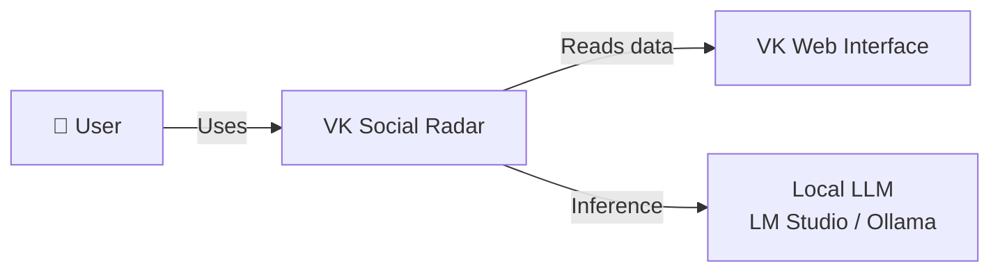
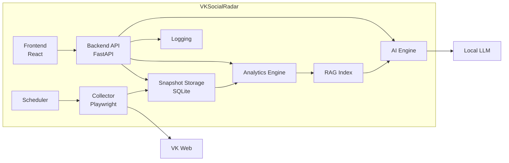
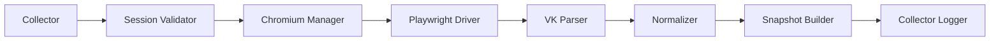
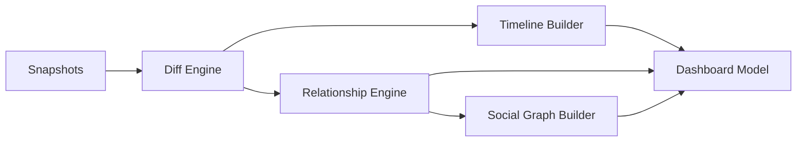
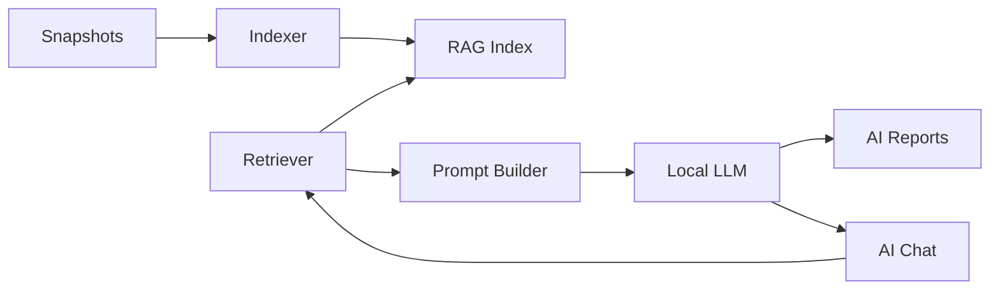
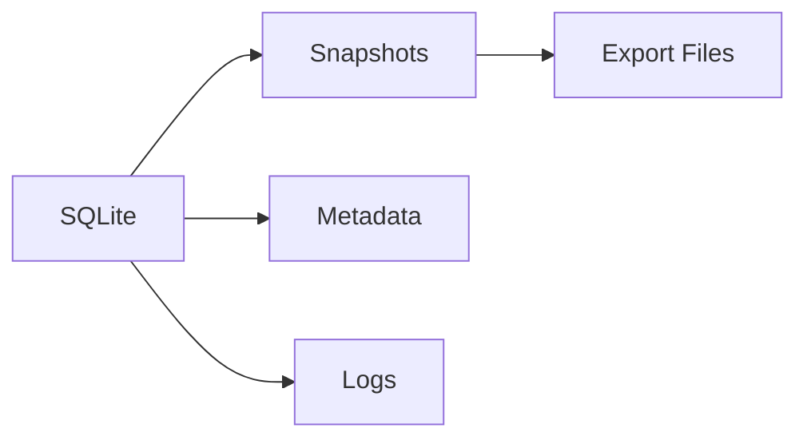
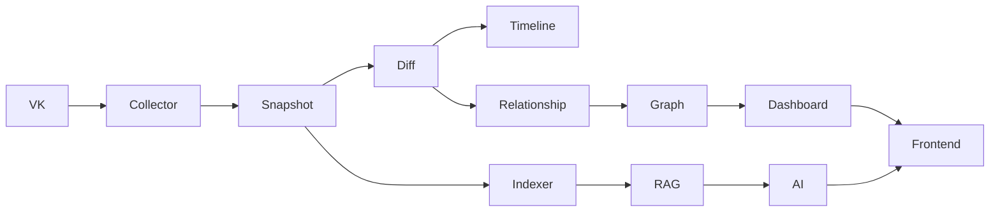
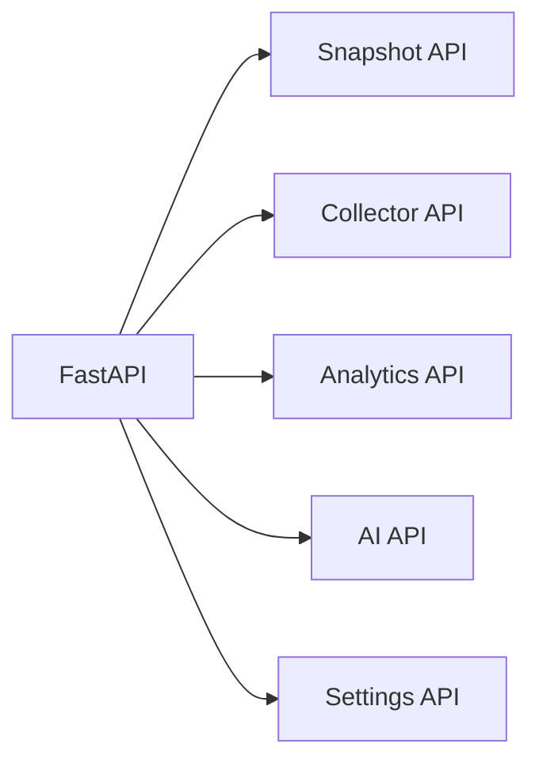
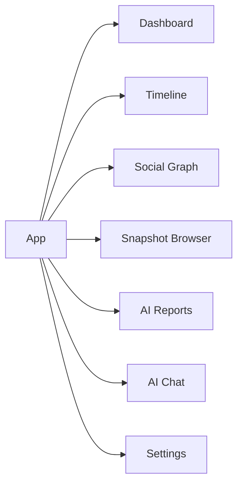

> **Architecture status: TARGET / EVOLUTIONARY DESIGN.**
> This document describes intended architecture and is not evidence that every component is implemented.
> Verified AS-IS: [docs/certification/C4_CURRENT.md](docs/certification/C4_CURRENT.md).
> Implementation status: [docs/certification/ARCHITECTURE_STATUS.md](docs/certification/ARCHITECTURE_STATUS.md).

# 09_C4_MODEL.md

# C4 Model

**Project:** VK Social Radar

---

# Level 1 — System Context

---

# Level 2 — Container Diagram

---

# Level 3 — Collector Components

---

# Level 3 — Analytics Components

---

# Level 3 — AI Components

---

# Level 3 — Storage Components

---

# Level 3 — Runtime Data Flow

---

# Level 4 — Backend API Components

---

# Level 4 — Frontend Components

