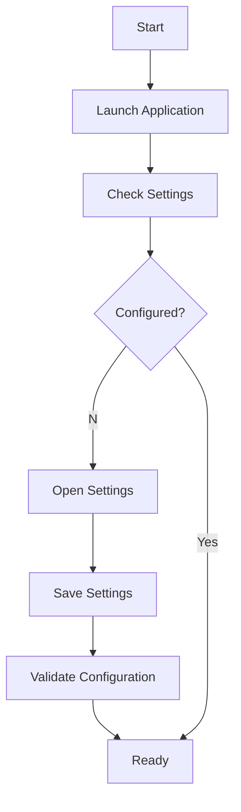
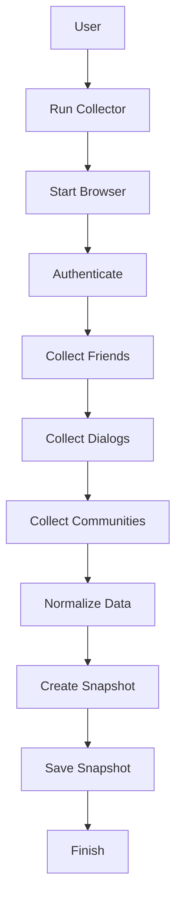
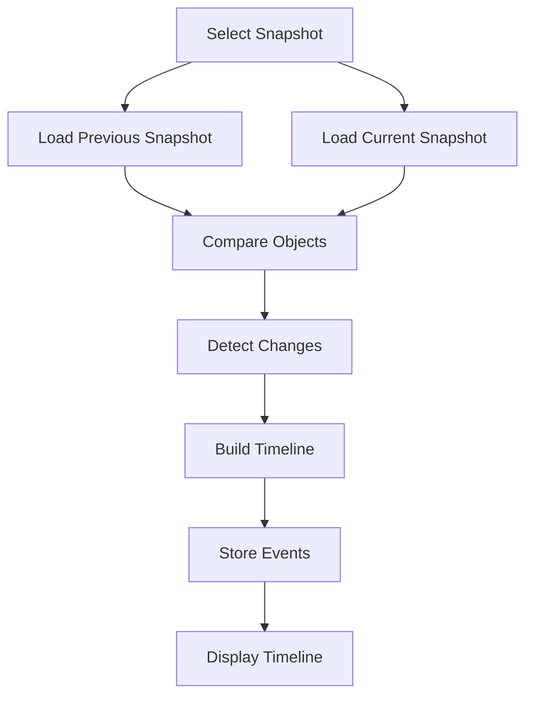
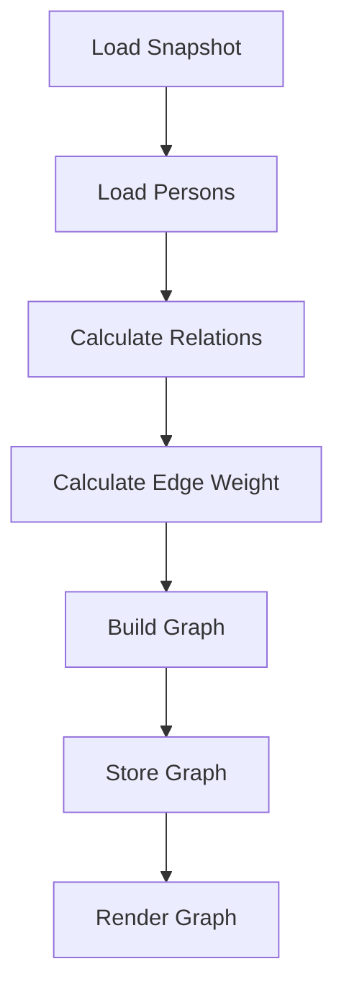
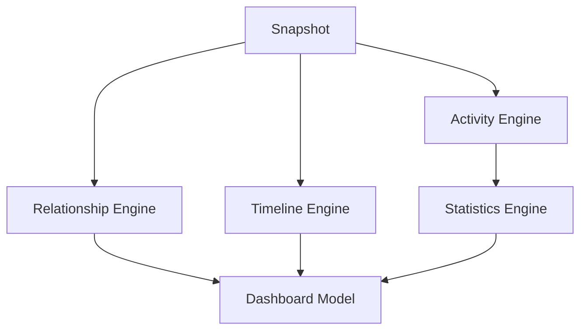
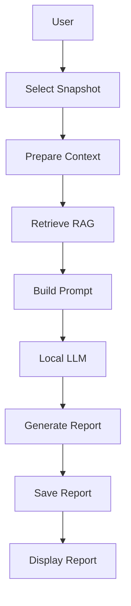
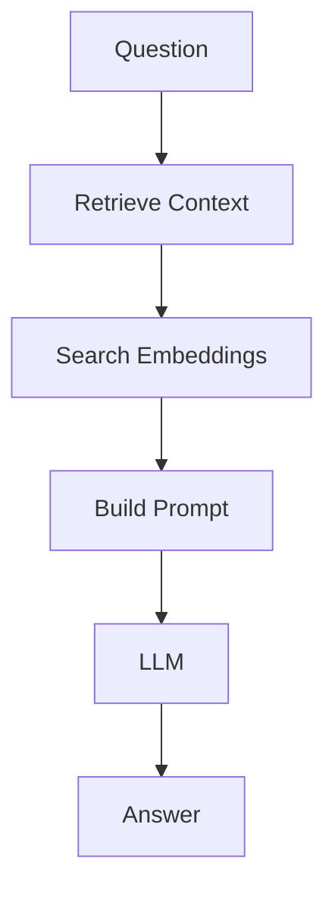
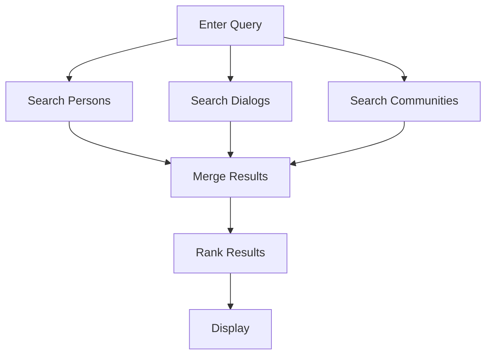
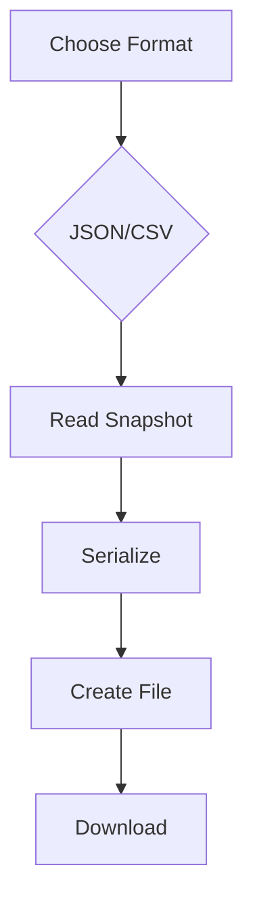
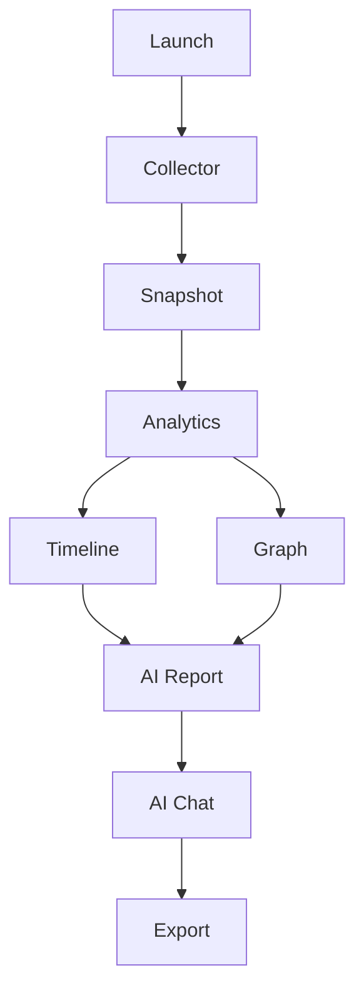

> **Architecture status: TARGET / EVOLUTIONARY DESIGN.**
> This document describes intended architecture and is not evidence that every component is implemented.
> Verified AS-IS: [docs/certification/C4_CURRENT.md](docs/certification/C4_CURRENT.md).
> Implementation status: [docs/certification/ARCHITECTURE_STATUS.md](docs/certification/ARCHITECTURE_STATUS.md).
>
> **U03 current scope (2026-09-24):** immutable friend/follower snapshots are implemented, with frozen membership/person fields and derived adjacent-pair events. Current physical lifecycle is CREATING → COMPLETE / INCOMPLETE / FAILED; only declared COMPLETE sets become current. Collector/HTML observations remain incomplete. The broader full-corpus models/flows below remain TARGET, not current code; message_stats/AI are not snapshot-reproducible, and no Event Sourcing, automatic AI or Repository framework was added. [U03 model/flow/evidence](docs/certification/U03_IMMUTABLE_SNAPSHOT_REPORT.md).

# 14_BUSINESS_PROCESSES.md

# Business Processes

Project: VK Social Radar

Version: 1.0

---

# Overview

Документ описывает основные бизнес-процессы системы.

Каждый процесс показывает взаимодействие пользователя, Collector, Backend, Analytics и AI.

---

# BP-01. Первичная настройка системы

## Назначение

Подготовка приложения к первому запуску.

### Комментарий

Пользователь один раз указывает настройки Collector, локальной LLM и пути хранения данных. После успешной проверки система готова к работе.

---

# BP-02. Сбор данных VK

## Назначение

Получение актуального снимка данных из VK.

### Комментарий

Collector не изменяет существующие данные. Каждый запуск формирует новый Snapshot, содержащий полное состояние социальной сети на момент сбора.

---

# BP-03. Анализ изменений

## Назначение

Выявление изменений между двумя Snapshot.

### Комментарий

Система сравнивает два состояния данных и строит историю изменений: новые друзья, удалённые контакты, изменения профилей, активности и подписок.

---

# BP-04. Построение социального графа

## Назначение

Формирование графа связей пользователя.

### Комментарий

Граф отражает взаимосвязи между людьми и используется как основа для аналитики и визуализации.

---

# BP-05. Расчёт аналитики

## Назначение

Вычисление производных показателей.

### Комментарий

На основе Snapshot вычисляются рейтинги отношений, активность пользователей, статистика общения и агрегированные показатели для Dashboard.

---

# BP-06. Генерация AI Report

## Назначение

Создание аналитического отчёта средствами LLM.

### Комментарий

AI получает только подготовленный контекст. Прямой доступ к базе данных отсутствует. Для повышения качества ответов используется RAG.

---

# BP-07. AI Chat

## Назначение

Ответы AI на вопросы пользователя.

### Комментарий

Каждый вопрос проходит через Retrieval, после чего формируется промпт для локальной языковой модели.

---

# BP-08. Поиск

## Назначение

Глобальный поиск по данным проекта.

### Комментарий

Поиск выполняется одновременно по нескольким источникам, после чего результаты объединяются и сортируются по релевантности.

---

# BP-09. Экспорт данных

## Назначение

Экспорт данных проекта.

### Комментарий

Пользователь может выгрузить как исходные данные Snapshot, так и результаты аналитики в стандартных форматах.

---

# BP-10. Полный жизненный цикл анализа

## Назначение

Сквозной сценарий работы системы.

### Комментарий

Этот процесс объединяет все ключевые функции VK Social Radar: сбор данных, формирование Snapshot, анализ, построение графа, генерацию AI-отчётов и экспорт результатов.

---

# Business Process Principles

Все процессы построены в соответствии со следующими принципами:

- Snapshot является единственным источником истины.
- Collector не выполняет аналитические вычисления.
- Аналитика работает только с сохранёнными Snapshot.
- AI получает данные исключительно через слой RAG.
- Все процессы являются идемпотентными и могут быть повторно выполнены без нарушения целостности данных.