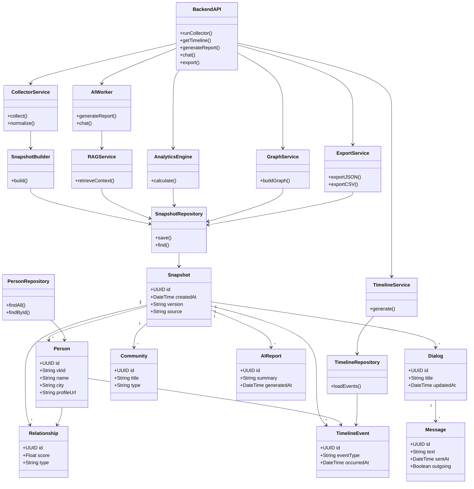

> **Architecture status: TARGET / EVOLUTIONARY DESIGN.**
> This document describes intended architecture and is not evidence that every component is implemented.
> Verified AS-IS: [docs/certification/C4_CURRENT.md](docs/certification/C4_CURRENT.md).
> Implementation status: [docs/certification/ARCHITECTURE_STATUS.md](docs/certification/ARCHITECTURE_STATUS.md).

# 16_CLASS_DIAGRAM.md

# Class Diagram

Project: VK Social Radar

Version: 1.0

---

# Purpose

Документ описывает логическую объектную модель системы.

В отличие от ER Diagram, которая показывает структуру хранения данных, Class Diagram отражает:

- основные доменные объекты;
- сервисы приложения;
- зависимости между компонентами;
- композицию и агрегацию;
- взаимодействие бизнес-логики.

Диаграмма не привязана к конкретному языку программирования и служит логической моделью предметной области.

---

# Основные категории классов

В архитектуре выделяются следующие группы классов:

- Domain Model
- Services
- AI Layer
- Persistence Layer
- API Layer

---

# UML Class Diagram

---

# Описание классов

## Snapshot

Корневой объект системы.

Представляет собой неизменяемый снимок состояния социальной сети пользователя.

Все аналитические сервисы работают исключительно со Snapshot.

---

## Person

Описывает пользователя VK.

Используется:

- Timeline;
- Social Graph;
- Analytics;
- AI.

---

## Dialog

Описывает диалог пользователя.

Содержит сообщения.

---

## Message

Минимальная единица коммуникации.

Используется аналитикой активности и AI.

---

## Community

Сообщество VK.

Используется для анализа интересов пользователя.

---

## Relationship

Отражает вычисленную связь между двумя пользователями.

Не является исходными данными.

Создаётся Analytics Engine.

---

## TimelineEvent

Описывает изменение между Snapshot.

Например:

- новый друг;
- удаление друга;
- изменение профиля;
- вступление в группу.

---

## AIReport

Сохранённый результат генерации LLM.

Позволяет избежать повторной генерации.

---

## CollectorService

Получает данные из VK.

Не содержит аналитической логики.

---

## SnapshotBuilder

Создаёт Snapshot.

Выполняет:

- нормализацию;
- агрегацию;
- связывание объектов.

---

## AnalyticsEngine

Вычисляет:

- рейтинги;
- статистику;
- показатели активности;
- связи.

---

## TimelineService

Формирует историю изменений.

Работает исключительно с Snapshot.

---

## GraphService

Строит социальный граф.

Используется Dashboard и AI.

---

## AIWorker

Единая точка работы с LLM.

Поддерживает:

- генерацию отчётов;
- AI Chat.

---

## RAGService

Подготавливает контекст.

Не выполняет генерацию текста.

---

## ExportService

Формирует:

- JSON;
- CSV;
- будущие форматы.

---

## BackendAPI

Фасад всей системы.

Координирует работу сервисов.

Не содержит бизнес-логики.

---

# Архитектурные принципы

Диаграмма отражает следующие принципы проектирования:

- Single Responsibility Principle;
- Dependency Inversion Principle;
- Repository Pattern;
- Service Layer Pattern;
- Immutable Snapshot Model;
- Separation of Concerns.

Все зависимости направлены сверху вниз: API → Services → Repository → Domain Model. Доменные классы не зависят от сервисов, что позволяет развивать систему независимо от используемой технологии хранения данных и реализации бизнес-логики.