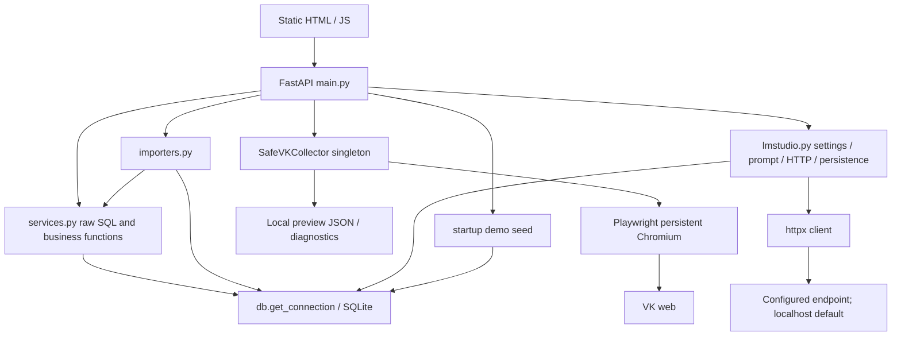

# Architecture Inventory — AS-IS

Дата: 2026-09-23; рабочая копия `C:\Developments\Javascript\VK`, Git revision недоступна. Evidence ниже — runtime code/wiring; SDD подтверждает только намерение. `Wired=YES` означает достижимость из API/UI, а не live проверку VK/LLM. Таблицы оценивают заявленную ответственность целиком, поэтому работающий transport не равен готовому Provider component.

## C4 ↔ code

| Component | Documented | Code exists | Wired | Tested | Status | Evidence |
|---|---|---|---|---|---|---|
| Frontend | YES, React + graph/chat/snapshots | YES, vanilla JS | YES | NO UI automation | PARTIAL | `static/app.js:15,21,28,38`; `app/main.py:28,37` |
| Backend API | YES | YES | YES | audit health only | IMPLEMENTED | 29 operations, `app/main.py:42–258`; контракт существенно иной |
| Collector | YES, Playwright | YES | YES API/UI; org API only | PARTIAL | IMPLEMENTED | `SafeVKCollector.start:186`, `collect:617`, `collect_public_organization_source:1801`; live VK не запускался |
| Scheduler | YES | NO | NO | NO | DOCUMENTED_ONLY | `09_C4_MODEL.md` Scheduler; asyncio job не периодический scheduler |
| Snapshot Storage | YES | PARTIAL, relation rows | YES | PARTIAL | PARTIAL | `app/db.py:45`, `services._snapshot_ids:21`; нет snapshot aggregate |
| Snapshot Builder | YES | PARTIAL, imports | YES | PARTIAL | PARTIAL | `services.import_snapshot:165`, `save_collector_preview:289` |
| Diff Engine | YES | PARTIAL, set subtraction | YES inside import/dashboard | PARTIAL | PARTIAL | `services.import_snapshot:176,207`, `dashboard:31`; нет выбора двух snapshot IDs |
| Timeline | YES | PARTIAL, event journal | YES | PARTIAL, seeded events | PARTIAL | `services.list_changes:132`, `person_detail:104`; `main:65` |
| Relationship Engine | YES, scores | PARTIAL, transitions/initiative | YES | PARTIAL | PARTIAL | `services:223,146`; score model не реализован |
| Social Graph | YES | NO | NO | NO | DOCUMENTED_ONLY | `09_C4_MODEL.md`, отсутствует route/table/builder |
| Analytics Engine | YES | PARTIAL, SQL aggregates | YES | PARTIAL | PARTIAL | `services.dashboard:31`, `message_leaderboard:146`; нет snapshot scope/score |
| AI Engine/Worker | YES | PARTIAL, synchronous person insight | YES | NO inference tests | PARTIAL | `main.create_insight:132` → `lmstudio.generate_person_insight:57`; worker/chat/report по snapshot отсутствуют |
| RAG | YES | NO | NO | NO | DOCUMENTED_ONLY | `08_SYSTEM_ARCHITECTURE.md` AI Components; inference обходит retrieval |
| LLM Provider | YES, LM Studio/Ollama | PARTIAL, concrete LM Studio HTTP | YES | settings only | PARTIAL | `lmstudio:40,57`, `main:13`; abstraction NOT_IMPLEMENTED |
| Logging | YES | PARTIAL, diagnostics/errors | YES | marker checks | PARTIAL | `collector._save_diagnostics:2650`, operations traces; нет единого structured logging/metrics |
| Export | YES | NO | NO | NO | DOCUMENTED_ONLY | `11_OPENAPI.yaml:591,607`; JSON preview — internal persistence, не export API |
| Search | YES, global | PARTIAL, client filters | YES | NO | PARTIAL | `static/app.js:29,147`; server search/ranking отсутствуют |
| Settings | YES | YES for LM Studio keys | YES | defaults tested | IMPLEMENTED | `lmstudio.get_settings:11/save_settings:17`, `main:105,110`, `test_v02.py` |

Итого по этим **18** строкам: **IMPLEMENTED 3 / PARTIAL 11 / DOCUMENTED_ONLY 4 / MISSING 0**. Нулевой MISSING здесь означает, что отсутствующие компоненты уже описаны в SDD; это не отсутствие пробелов. Ограниченный Settings implemented в собственном текущем scope, не в расширенном scope SDD.

## Фактические зависимости и runtime

Collector не пишет relations автоматически. `main.collector_save_preview:248` передаёт in-memory preview в services; friends/followers → import_snapshot → diff/events; dialogs → отдельная таблица. Организационные jobs сохраняют JSON и in-memory result, но не Community/SnapshotCommunity. Async operations (`collector:2178`) не переживают перезапуск; generic collection завершается в HTTP request. AI выполняется синхронной `def`-функцией FastAPI в threadpool; отдельной очереди/worker нет.

## Architecture fitness

| Зависимость | Фактический verdict | Evidence / ограничение |
|---|---|---|
| Frontend → DB | НЕ ОБНАРУЖЕНА | `static/app.js:15` fetch API; SQLite отсутствует в frontend |
| Analytics → VK | НЕ ОБНАРУЖЕНА | `services.py` зависит от db/date/typing, не от browser/HTTP |
| AI → VK | НЕ ОБНАРУЖЕНА | `lmstudio.py` читает settings/полученный person_data, вызывает настроенный inference endpoint |
| Domain → Playwright | НЕ ОБНАРУЖЕНА как импорт доменного слоя | отдельного domain package нет; dicts и CollectorState/Operation внутри инфраструктуры не доказывают Clean Architecture |
| Domain → FastAPI | НЕ ОБНАРУЖЕНА | FastAPI imports в main; domain abstraction отсутствует |
| Service → concrete infrastructure | ПРИСУТСТВУЕТ | services → get_connection + SQL; importers → concrete service; main → collector singleton + LM functions; `lmstudio:6,11,131` → httpx/SQLite |
| Collector → Analytics business logic | scoring/diff зависимость НЕ ОБНАРУЖЕНА | нет services imports; есть collection policy `membership_is_employment_proof=False` и source classification, не Relationship Engine |

API → Service → Interface → Infrastructure **не реализовано**: слой Interface отсутствует. Инфраструктурные детали агрегированы по файлам, но DIP из этого не следует.

## OpenAPI ↔ implementation

Два одинаковых YAML: `11_OPENAPI.yaml` и `specs/001-vk-profile-analysis/11_OPENAPI.yaml`; третья идентичная копия в `Artefacts.zip`. YAML 3.1.0, API 1.0.0, servers `http://localhost:8000/api/v1` / HTTPS localhost. Реальный runtime: API 0.4.2, `http://127.0.0.1:8765/api`, generated OpenAPI 3.1.0 по `app.openapi()` (также стандартный `/openapi.json`). YAML в приложение не загружается.

18 documented operations против 29 actual API operations. При точном сравнении полных URL-prefix совпадений **0**. После нормализации префикса совпадают только **4 method/path**: GET health, GET/PUT settings, GET collector/status. Нормализация не означает совместимость схем или security.

### Documented but missing in code

| YAML operation (без `/api/v1`) | Фактическое состояние |
|---|---|
| POST `/collector/run` | Нет; `/collector/start` только открывает Chromium, `/collect/{kind}` собирает отдельный kind |
| GET `/snapshots`; GET/DELETE `/snapshots/{snapshotId}` | Нет snapshot resource или browsing/deletion API |
| GET `/persons`; GET `/persons/{personId}` | Иные `/people` и `/people/{person_id}`; не совместимые alias |
| GET `/timeline` | Только `/changes` и события person_detail |
| GET `/relationships` | Нет; часть метрик в leaderboard |
| GET `/graph` | Нет |
| POST `/ai/report/{snapshotId}` | Только person insight, не report по snapshot |
| POST `/ai/chat` | Нет |
| GET `/search` | Нет; frontend filters |
| GET `/export/json`; GET `/export/csv` | Нет |

Итого 14 отсутствующих normalized operations. API_GUIDE дополнительно обещает GET `/dialogs/{dialogId}`, `/messages`, `/communities`, `/communities/{communityId}`, `/analytics/dashboard`, `/analytics/summary`, `/export/report`: в runtime их нет, и в YAML paths они также не описаны. Tags Analytics/Dialogs/Messages/Communities в YAML не являются endpoint definitions.

### Реальный контракт и implemented but missing in YAML

Все пути ниже реальные, префикс `/api`. Типы ответов — фактические Python return shapes, а не строгие domain response models. Все успешные ответы по умолчанию 200.

| Method/path | Request / response | YAML counterpart | Evidence main.py |
|---|---|---|---|
| GET `/health` | `{status,version}`; liveness, без проверок DB/LLM | normalized match | 42 |
| GET `/dashboard` | friends/followers counts, message_total, changes, top_people, recent_imports | missing | 47 |
| GET `/people` | array; is_friend/is_follower, metrics; без pagination | missing | 52 |
| GET `/people/{person_id}` | int ID; `{person,message_stats,events,insights}` | missing | 57 |
| GET `/changes` | limit=100, clamp 1..500 → event array | missing | 65 |
| GET `/messages/leaderboard` | array, aggregates + initiative % | missing | 70 |
| POST `/import/snapshot` | generic dict: relation_type/date/people → counts | missing | 75 |
| POST `/import/file` | multipart file/import_type/relation_type/date → result/job_id/stored_as | missing | 83 |
| GET `/settings` | string key/value object | normalized match | 105 |
| PUT `/settings` | arbitrary dict, only 3 LM keys accepted; returns settings | normalized match | 110 |
| GET `/lmstudio/models` | model array; 503 on exception | missing | 115 |
| POST `/lmstudio/test` | `{ok,models_count,models}`; 503 on exception | missing | 123 |
| POST `/people/{person_id}/insight` | int ID, no body → insight + stored id | missing | 131 |
| POST `/collector/start` | browser state; 500 on start error | missing | 143 |
| POST `/collector/close` | state | missing | 151 |
| DELETE `/collector/profile` | deletes profile (аудит НЕ вызывал) | missing | 156 |
| GET `/collector/status` | runtime state / auth / URLs / errors | normalized match | 161 |
| POST `/collector/check-auth` | auth/status | missing | 166 |
| POST `/collector/navigate/{target}` | home/friends/followers/dialogs → state | missing | 174 |
| POST `/collector/collect/{kind}` | friends/followers/dialogs → preview | missing | 182 |
| GET `/collector/source/classify` | source_url query → classification | missing | 190 |
| POST `/collector/organization-source` | source_url + options dict → org result | missing | 195 |
| POST `/collector/organization-source/jobs` | source_url + options → operation, либо COLLECTOR_BUSY (200) | missing | 207 |
| GET `/collector/organization-source/jobs/{operation_id}` | operation; 404 when unknown | missing | 216 |
| GET `/collector/organization-source/jobs/{operation_id}/result` | operation/result_available/result | missing | 224 |
| POST `/collector/organization-source/jobs/{operation_id}/cancel` | cancellation state | missing | 232 |
| GET `/collector/preview` | preview; 404 if absent | missing | 240 |
| POST `/collector/save-preview` | save current preview → counts | missing | 247 |
| GET `/dialogs` | limit=500, clamp 1..2000 → latest collected_at rows | missing in YAML; guide mentions | 256 |

25 normalized actual-only operations; root `/` и framework docs/static служебные routes в этот счёт не включены.

### Mismatches

| Категория | Evidence-based finding |
|---|---|
| Method/path | `/api/v1` vs `/api`, `/persons` vs `/people`, `/collector/run` vs раздельный start/collect/save. Export GET из YAML vs POST snapshot export в feature contract: расходятся даже документы |
| Request schema | YAML SettingsUpdate/ChatRequest и другие schemas — только `type: object`; конкретные поля проверить невозможно. Guide PUT settings предлагает collector_interval/llm_provider/language, а `lmstudio.save_settings:18` их молча игнорирует. int person_id в runtime против UUID в YAML. Pagination/city query не поддерживаются |
| Response schema | YAML PersonPage/TimelinePage требуют object, фактические closest equivalents people/changes возвращают arrays. Guide health database/collector/ai отсутствуют; settings success:true заменён key/value; person object заменён composite response. AI report и insight различны по scope |
| Status/error model | collector/run обещает 202, реальные start/collect/jobs 200. API_GUIDE `{error,message,details}` против HTTPException `{detail}` и FastAPI 422 validation detail array. Runtime generated schema не декларирует вручную поднятые 400/404/500/503 |
| Security | YAML global BearerAuth, main не использует auth dependency/middleware. API_GUIDE делает health public, YAML не отменяет global security для health |
| OpenAPI structural quality | `license` находится в корне YAML, должно относиться к Info Object; domain schemas не раскрыты. Полный validator не запускался |

**OpenAPI consistency: FAIL.** Generated schema подтверждает реальные маршруты, но generic dict annotations не дают полноценного контрактного дизайна.

## ER ↔ SQLite / runtime

Документы: `10_DATA_MODEL.md` (ER/UUID), `specs/001-vk-profile-analysis/data-model.md` (другая логическая модель: SnapshotItem/Diff/RAGIndex и др.). Fresh DDL — `app/db.py:33`. Рабочая БД проверена `mode=ro` без пользовательских данных.

| Entity | Documented | Implemented | Persisted | Relations valid | Notes |
|---|---|---|---|---|---|
| Snapshot | YES | PARTIAL surrogate | relation_snapshots rows | NO aggregate FK | нет id/version/status/source_run/full state; empty snapshot не представим |
| Person | YES | people | YES | FK parent exists | integer id/vk_id, full_name; нет versioned profile attributes (`db:35`) |
| SnapshotPerson | YES | PARTIAL relation_snapshots | YES | person FK valid; snapshot FK absent | unique person/type/date, нет following/hash/snapshot_id (`db:45`) |
| Dialog | YES | PARTIAL collector_dialogs | YES, old schema | NO Person FK | peer_id не FK; уникальность key+timestamp вместо unique dialog; schema drift (`db:98`) |
| Message | YES | NO | NO | N/A | preview — не нормализованное message; message_stats — агрегаты |
| Community | YES | PARTIAL public-source dict | preview JSON only | NO entity relations | нет table/CRUD; не inventory пользовательских сообществ (`collector:1801`) |
| SnapshotCommunity | YES | NO | NO | N/A | нет snapshot/community tables |
| Relationship | YES | PARTIAL calculations/events | relation_events | person FK only | нет score/calculated_at/snapshot_id (`services:223`) |
| TimelineEvent | YES | PARTIAL relation_events | YES | person FK; snapshot FK absent | mutable/dedup absent (`db:54`) |
| GraphEdge | YES | NO | NO | N/A | нет nodes/edges builder/table |
| AIReport | YES | PARTIAL ai_insights | YES | person FK, no snapshot FK | model/status/confidence/summary/evidence/cautions; no prompt_hash (`db:84`) |
| Embedding | YES | NO | NO | N/A | нет embedding calls/index/vector table |
| CollectorRun | YES | PARTIAL CollectorOperation | RAM only, some result JSON | NO run→snapshot | jobs dictionary не durable run history (`collector:117,2178`) |
| Settings / ApplicationSettings | YES | app_settings | YES | key PK | нет UUID; 3 editable LM settings (`db:78`) |
| MessageStats | не отдельная entity root ER | YES | message_stats | person FK + unique period | mutable period upsert, не snapshot scoped (`db:63`, `services:250`) |
| ImportJob | не root ER | YES | import_jobs | no entity/run FK | status/filename/count/error (`db:115`, `importers:90`) |
| UserSession | feature model | PARTIAL CollectorState + Chromium profile | browser filesystem | no DB relation | app state/auth result volatile (`collector:103`) |
| SnapshotItem, Diff record, ChangeEvent, TimelineEntry, RelationshipInsight, GraphModel | feature model | лишь частичные analogues выше | dedicated tables NO | N/A | `specs/001-vk-profile-analysis/data-model.md`, unchecked tasks T006 |
| RAGIndex, AIChatSession, PersonalCRMItem, ExportPackage, CollectionError | feature model | NO dedicated entities | NO | N/A | diagnostics не CollectionError repository; text plan не schema |
| TestDefinition/TestRun (testing feature) | separate feature model | NO | NO | N/A | `specs/001-testing-feature/data-model.md`, 46 unchecked tasks |

Реально существующие 8 таблиц: `people`, `relation_snapshots`, `relation_events`, `message_stats`, `app_settings`, `ai_insights`, `collector_dialogs`, `import_jobs`. FK из четырёх дочерних таблиц ведут на people: relation_snapshots, relation_events, message_stats, ai_insights. В рабочей БД `foreign_key_check` = 0, но целостность ER связей snapshot/run не обеспечивается, поскольку этих сущностей нет.

**Data model consistency: FAIL** — целевая модель не совпадает с DDL; DDL дополнительно не совпадает с установленной БД. Наличие migration/versioning — отдельный P0, независимо от будущего изменения ER.
