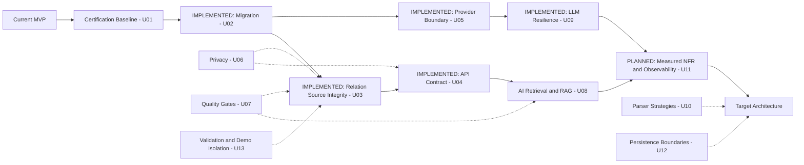

# Architecture Evolution

Baseline 1.0 + U02/U05/U09 · 2026-09-23. Working MVP → Architecture Audit → Known Gaps → ADR → Target Architecture → Prioritized Upgrade Backlog → Controlled Evolution. После documentary baseline реализованы migration, immutable relation snapshots, provider boundary и generation resilience; остальные milestones сохраняют собственные acceptance gates.

Стрелки основных этапов показывают накопление готовности, не запрет на раннее проектирование NFR/tests/privacy. U09 build scope разрешает небольшие internal defaults с доказанными attempts/sleep bounds без утверждения total deadline или measured SLO. U11 ещё должен измерить latency и обосновать tuning/deadline; U07 развивается с U02, а не ждёт конца. U10/U12/U13 вводятся инкрементально и не требуют переписывания всего MVP.

| Stage / backlog | Objective | Architectural value | Acceptance evidence | Current state |
|---|---|---|---|---|
| Current MVP / audit | зафиксировать работающие flows и ограничения | независимая отправная точка | [00–05 audit](README.md); 18 + 8 prior passes; выявленные defects | существует, с gaps |
| U01 baseline | разделить AS-IS/target/backlog, формализовать ADR | проверяющий различает решение и код | [status](ARCHITECTURE_STATUS.md), two C4, six ADR, links/checklist | documentary baseline; protected tag recorded in build reports |
| U02 migration | сохранить existing records при schema upgrade | управляемая эволюция данных | [14 tests/report](U02_SCHEMA_MIGRATION_REPORT.md): legacy 6→13, backup, rollback, idempotency | IMPLEMENTED; user DB not migrated during build |
| U03 snapshot | immutable relation aggregate and derived membership events | reproducible historical projection; safe empty/same-day/backdated semantics | [U03 evidence](U03_IMMUTABLE_SNAPSHOT_REPORT.md): 34 new; 117 unittest + 8 additional PASS; v1→v2 backup/rollback/FK | IMPLEMENTED narrow relation foundation; messages excluded |
| U04 API | canonical runtime contract/errors/security truth | enforceable API evolution | [23 tests/report](U04_API_CONTRACT_REPORT.md); 30 operations/21 UI calls, exact generated drift gate; `/api` preserved | IMPLEMENTED; authentication remains U06 |
| U05 provider | отвязать AI use cases от vendor HTTP | заменяемость и test seam | [26 tests/report](U05_LLM_PROVIDER_REPORT.md): fake + LM adapter contracts, local validation, API, import fitness | IMPLEMENTED at AI boundary; global DIP PARTIAL |
| U06 privacy | enforce local policy/minimize sensitive artifacts | доказуемая privacy boundary | negative endpoint tests, sanitized fixture logs, fail-closed guard; real Git/package evidence | PARTIAL AS-IS, hardening PLANNED |
| U07 quality | единый runner + CI | green result отражает meaningful invariants | local migration/source/API/provider gates exist; unified collection and CI without VK session remain target | unified runner/CI PLANNED |
| U08 retrieval | локальные grounded report/Q&A | найденный контекст с source evidence | synthetic labelled corpus, retrieval relevance, citations, no-evidence behavior, freshness scope | PLANNED / runtime NO_RAG |
| U09 resilience | bounded generation retry + breaker | transient recovery, fail-fast outage gate | [25 tests/report](U09_LLM_RESILIENCE_REPORT.md): clocks/randomness, classifier, bounded sleeps, state/probe/concurrency, API; 83 + 8 regressions PASS | IMPLEMENTED; total deadline NOT enforced |
| U10 strategies | replaceable parsers для existing surfaces | ограничить DOM-change impact | fixture extraction и substitution без изменения orchestration | PLANNED |
| U11 NFR/observability | измеримые ограничения и safe events | решения основаны на measurements | hardware/dataset-labelled measurements, latency/error counters, retention policy; [NFR](NFR_BASELINE.md) | quantitative baseline PLANNED |
| U12 persistence ports | убрать SQL из selected use cases | testability и cohesion | port fake tests + SQLite adapter contract; не interface для каждой функции | PLANNED |
| U13 validation/demo | разделить synthetic/user data и external identity | data provenance и input safety | explicit demo mode; identity/collision/date/ZIP budget tests; org-save semantics | PLANNED |

[Backlog U01–U17](05_UPGRADE_BACKLOG.md) остаётся исходным приоритетным списком. P2: U14 scheduling/durable jobs, U15 local export/restore, U16 graph/scores, U17 search/retrieval evolution. U02/U03/U04/U05/U09 закрыты в заявленном scope; U06 — следующий рекомендуемый implementation increment, без автоматического начала. RAG NO_RAG/PLANNED, Ollama/fallback NO. [Baseline report](BASELINE_UPGRADE_REPORT.md) остаётся историческим; новые результаты находятся в отдельных build reports.
