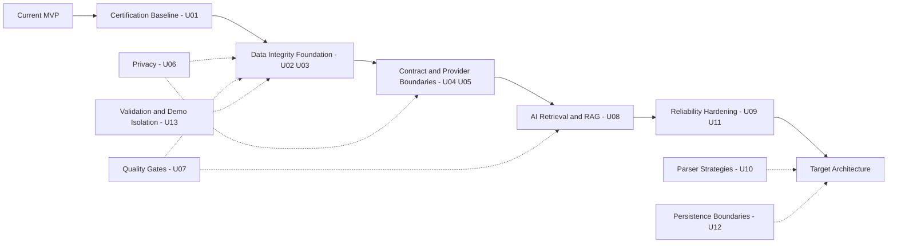

# Architecture Evolution

Baseline 1.0 · 2026-09-23. Working MVP → Architecture Audit → Known Gaps → ADR → Target Architecture → Prioritized Upgrade Backlog → Controlled Evolution. Эта итерация меняет evidence/navigation, не product runtime.

Стрелки основных этапов показывают накопление готовности, не запрет на раннее проектирование NFR/tests/privacy. U11 должен установить NFR до реализации U09; U07 развивается с U02, а не ждёт конца. U10/U12/U13 вводятся инкрементально и не требуют переписывания всего MVP.

| Stage / backlog | Objective | Architectural value | Acceptance evidence | Current state |
|---|---|---|---|---|
| Current MVP / audit | зафиксировать работающие flows и ограничения | независимая отправная точка | [00–05 audit](README.md); 18 + 8 prior passes; выявленные defects | существует, с gaps |
| U01 baseline | разделить AS-IS/target/backlog, формализовать ADR | проверяющий различает решение и код | [status](ARCHITECTURE_STATUS.md), two C4, six ADR, links/checklist | documentary deliverables подготовлены; Git unknown |
| U02 migration | сохранить existing records при schema upgrade | управляемая эволюция данных | old six-column dialog schema → compatible new schema; repeat migration; failure rollback on fixture | PLANNED, следующий шаг |
| U03 snapshot | полноценный immutable aggregate и корректный diff | повторяемая аналитика/source lineage | same-day/repeated/empty/backdated tests, immutable historical read, complete vs partial collection | PLANNED |
| U04 API | единый typed contract/security/errors | воспроизводимые integration boundaries | runtime/schema method/path/request/response gates; compatibility decision `/api`→`/api/v1` | PLANNED |
| U05 provider | отвязать AI use cases от vendor HTTP | заменяемость и test seam | fake + LM adapter contract tests; no direct client dependency in business flow | PLANNED |
| U06 privacy | enforce local policy/minimize sensitive artifacts | доказуемая privacy boundary | negative endpoint tests, sanitized fixture logs, fail-closed guard; real Git/package evidence | PARTIAL AS-IS, hardening PLANNED |
| U07 quality | единый runner + минимальные gates | green result отражает meaningful invariants | все существующие tests collected, temp storage, CI без VK session, migration/API/provider regressions | suite частична, gate PLANNED |
| U08 retrieval | локальные grounded report/Q&A | найденный контекст с source evidence | synthetic labelled corpus, retrieval relevance, citations, no-evidence behavior, freshness scope | PLANNED / runtime NO_RAG |
| U09 resilience | bounded retry + breaker subject to NFR | ограниченный ущерб dependency failure | deterministic clocks/randomness; timeout/transient/permanent errors; state transitions/probe/concurrency | PLANNED |
| U10 strategies | replaceable parsers для existing surfaces | ограничить DOM-change impact | fixture extraction и substitution без изменения orchestration | PLANNED |
| U11 NFR/observability | измеримые ограничения и safe events | решения основаны на measurements | hardware/dataset-labelled measurements, latency/error counters, retention policy; [NFR](NFR_BASELINE.md) | quantitative baseline PLANNED |
| U12 persistence ports | убрать SQL из selected use cases | testability и cohesion | port fake tests + SQLite adapter contract; не interface для каждой функции | PLANNED |
| U13 validation/demo | разделить synthetic/user data и external identity | data provenance и input safety | explicit demo mode; identity/collision/date/ZIP budget tests; org-save semantics | PLANNED |

[Backlog U01–U17](05_UPGRADE_BACKLOG.md) остаётся исходным приоритетным списком. P2: U14 scheduling/durable jobs, U15 local export/restore, U16 graph/scores, U17 search/retrieval evolution. Baseline не закрывает U02–U13 и не продвигает P2 в обязательный scope. [Report](BASELINE_UPGRADE_REPORT.md) фиксирует точную границу выполненного.
