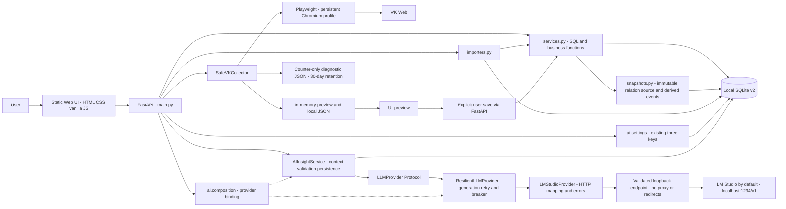

# C4 CURRENT — verified working copy

Baseline 1.0 + U02/U03/U04/U05/U09 · 2026-09-23. AS-IS: один local FastAPI process, static browser UI, SQLite/files и внешние VK web/local inference процессы. Это обзор context/containers с module-level деталями внутри backend, не утверждение об отдельных deployment services.

Configured endpoint — configuration boundary к LM Studio по умолчанию, а не отдельный обязательный proxy. U06 разрешает только parsed loopback URL; remote/LAN endpoints запрещены без opt-in. Diagnostics не импортируются в SQLite; явный save читает текущий in-memory preview, не diagnostics/JSON с диска.

| Boundary | Реальная implementation | Evidence |
|---|---|---|
| User/UI/API | fetch `/api/*`; static mount/root | [static/app.js](../../static/app.js), [app/main.py](../../app/main.py) |
| API/services/SQLite | concrete function calls и direct SQL | [services.py](../../app/services.py), [db.py](../../app/db.py) |
| Collector/browser | persistent context; collect friends/followers/dialogs; organization source | [SafeVKCollector](../../app/collector.py), start/collect/collect_public_organization_source |
| Preview/save | collect возвращает preview; save-preview вызывает service | main.collector_save_preview, services.save_collector_preview; [audit](01_ARCHITECTURE_INVENTORY.md) |
| AI | person_detail → AIInsightService → LLMProvider → ResilientLLMProvider → LMStudioProvider; local validation before ai_insights | [service](../../app/ai/service.py), [port](../../app/ai/provider.py), [wrapper](../../app/ai/resilience.py), [adapter](../../app/ai/providers/lmstudio.py), [composition](../../app/ai/composition.py); [U05](U05_LLM_PROVIDER_REPORT.md)/[U09 evidence](U09_LLM_RESILIENCE_REPORT.md) |

Friends/followers collector save сохраняет UNKNOWN/INCOMPLETE observation; declared manual/file relation imports создают COMPLETE v2 snapshots; dialogs save — в collector_dialogs. U02 предоставляет migration старой схемы; пользовательская DB не мигрировалась во время сборок. Organization-source result находится в памяти/JSON; общий save-preview его не поддерживает. Jobs volatile; startup вызывает init_db/demo seed. В отдельные nodes не вынесены все вспомогательные функции — это не отсутствие соответствующего кода.

U05 реализует DIP только на AI/provider boundary; global DIP PARTIAL. SQL persistence остаётся прямой. `app/lmstudio.py` — compatibility facade для прежних Python callers, production API его не импортирует. Models и connection test используют тот же provider port; test проверяет discovery, не inference readiness. U09 реализует Retry/Exponential Backoff/Full Jitter/Circuit Breaker для generation. Models проходят один раз без retry/state changes; auto-model selection может вызвать discovery даже при OPEN generation. Ollama/fallback отсутствуют.

Composition хранит одну active endpoint binding на процесс: breaker живёт между API requests; смена endpoint заменяет binding, model/temperature её не сбрасывают. CLOSED: максимум 3 attempts, max retry sleep 1.5s; threshold 3 logical failures; recovery 30s, один HALF_OPEN attempt. Состояние защищено Lock, transport/sleep вне lock. 8/120s transport timeouts сохранены; total deadline НЕ enforced.

Здесь нет React, Scheduler, RAG, AI Worker, Social Graph, Repository, Kafka или Redis. Non-AI analytics не читает VK напрямую, использует COMPLETE v2 snapshots для current relation counts; message analytics остаётся period-based и не snapshot-scoped. Код и wiring исследованы, live VK/LLM не запускались. [Target](C4_TARGET.md), [gaps](TECHNICAL_DEBT_REGISTER.md), [audit](00_REPOSITORY_AS_IS.md).

U03 adds snapshots/snapshot_people/snapshot_events and a nullable namespaced people.snapshot_key. Complete source rows are immutable; events are derived and can be repaired after backdated insertion. Order: captured_at then insertion sequence, date-only input retained with date precision. Per-stream legacy fallback stops at the first COMPLETE v2 capture. New event names/URLs come from frozen membership, legacy events remain labelled legacy_unknown. [U03 evidence](U03_IMMUTABLE_SNAPSHOT_REPORT.md).

U04 adds typed response/metadata at the existing FastAPI boundary. [Canonical OpenAPI](../../11_OPENAPI.yaml) is exported from app.openapi; [tests](../../tests/test_api_contract.py) check 30 operations/21 frontend call sites and reject drift. No new server, auth gateway, repository, route family or frontend dependency. [Contract evidence](U04_API_CONTRACT_REPORT.md).

U06 boundary: launcher 127.0.0.1 → Host/same-origin middleware → existing API. Settings/composition/LM adapter enforce loopback-only URLs and disable HTTPX proxies/redirects. Collector request routing fails closed; new diagnostics are counter-only with 30-day runtime-triggered cleanup. Dedicated profile, imports and previews use safe local roots; tracked disclosure guard runs offline. No auth service, encryption or remote opt-in. [Evidence](U06_PRIVACY_ACCESS_HARDENING_REPORT.md).

## Development verification boundary — U07

Local Python and the thin BAT wrapper invoke [one runner](../../scripts/run_quality_gates.py). The [GitHub Actions workflow](../../.github/workflows/quality-gates.yml) is configured to invoke the same runner on a Windows worker. These are development checks, not application runtime services. Runner → tracked privacy/syntax/OpenAPI/docs gates → one isolated 191-test suite → measured fitness verdicts. It does not connect to the diagram's user SQLite, VK, browser session or local inference service. Local PASS is verified; remote Actions execution is NOT YET VERIFIED.
