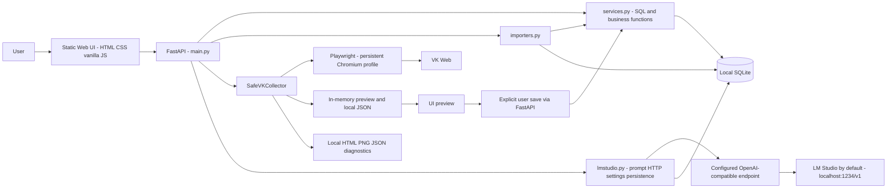

# C4 CURRENT — verified working copy

Baseline 1.0 · 2026-09-23. AS-IS: один local FastAPI process, static browser UI, SQLite/files и внешние VK web/local inference процессы. Это обзор context/containers с module-level деталями внутри backend, не утверждение об отдельных deployment services.

Configured endpoint — configuration boundary к LM Studio по умолчанию, а не отдельный обязательный proxy. Arbitrary URL разрешён текущим кодом, поэтому диаграмма не гарантирует local-only inference. Diagnostics не импортируются в SQLite; явный save читает текущий in-memory preview, не diagnostics/JSON с диска.

| Boundary | Реальная implementation | Evidence |
|---|---|---|
| User/UI/API | fetch `/api/*`; static mount/root | [static/app.js](../../static/app.js), [app/main.py](../../app/main.py) |
| API/services/SQLite | concrete function calls и direct SQL | [services.py](../../app/services.py), [db.py](../../app/db.py) |
| Collector/browser | persistent context; collect friends/followers/dialogs; organization source | [SafeVKCollector](../../app/collector.py), start/collect/collect_public_organization_source |
| Preview/save | collect возвращает preview; save-preview вызывает service | main.collector_save_preview, services.save_collector_preview; [audit](01_ARCHITECTURE_INVENTORY.md) |
| AI | person_detail → fixed context → HTTP completions → ai_insights | [lmstudio.py](../../app/lmstudio.py), main.create_insight |

Friends/followers save преобразуется в relation rows по дню; dialogs save — в collector_dialogs. Установленная DB имеет known schema drift. Organization-source result находится в памяти/JSON; общий save-preview его не поддерживает. Jobs volatile; startup вызывает init_db/demo seed. В отдельные nodes не вынесены все вспомогательные функции — это не отсутствие соответствующего кода.

Здесь нет React, Scheduler, RAG, AI Worker, Social Graph, Repository, Kafka или Redis. Non-AI analytics не читает VK напрямую, но **не** опирается на immutable Snapshot aggregate. Код и wiring исследованы, live VK/LLM не запускались. [Target](C4_TARGET.md), [gaps](TECHNICAL_DEBT_REGISTER.md), [audit](00_REPOSITORY_AS_IS.md).
