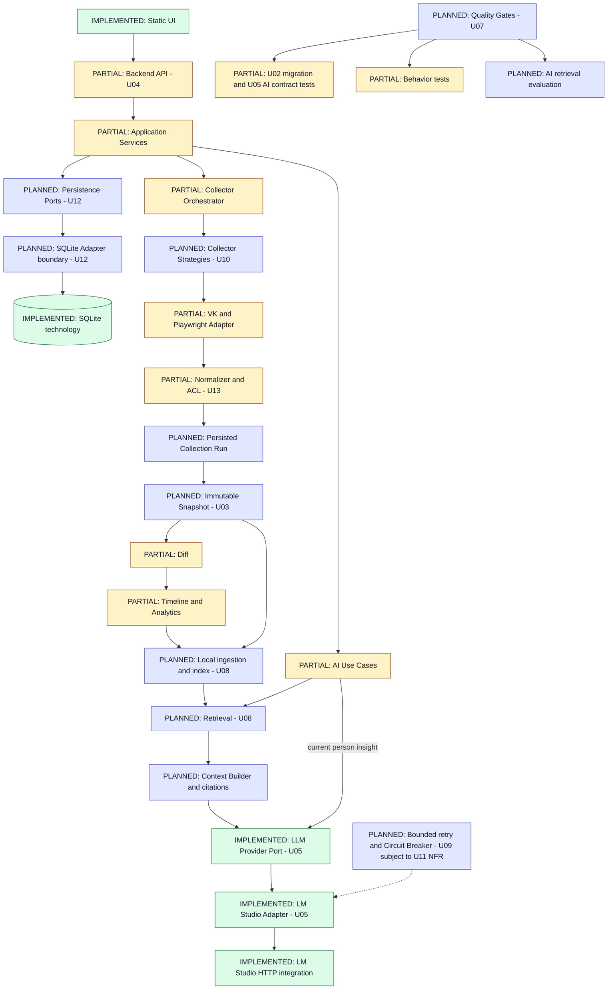

# C4 TARGET — accepted evolutionary design

Baseline 1.0 · 2026-09-23. **TARGET / PLANNED**, не runtime inventory. Сохраняется локальный модульный монолит: boxes ниже — логические ответственности, не microservices. Принятые [ADR](../adr/README.md) не означают завершённую реализацию.

Legend: IMPLEMENTED = существующая technology/component boundary; PARTIAL = существующая capability требует изменений; PLANNED = новый contract/mechanism. Статус указан текстом и цветом. Даже IMPLEMENTED box не доказывает готовность всех целевых стрелок.

U02 уже реализует безопасную schema migration; Snapshot/Run/derived records и application persistence contracts остаются целью U03/U12. На схеме не развёрнуты все CRUD стрелки. В target source snapshots неизменяемы, derived metrics/index/reports версионируются отдельно. Валидное полностью наблюдённое пустое состояние отличается от неудачного/неполного сбора; legacy task T018 требует согласования с ADR-003/U03.

LLM port уже отделяет current person insight use case от concrete HTTP — [U05 report](U05_LLM_PROVIDER_REPORT.md). Будущая retrieval цепочка ещё отсутствует: runtime NO_RAG; Ollama NOT IMPLEMENTED. Bounded retry и stateful breaker — целевой механизм U09 **subject to accepted NFR** U11; значения attempts/threshold/recovery ещё не назначены. Нет обещания hidden remote fallback. Vector DB, dense/hybrid/RRF/reranker не выбраны; U08 начинает с измеримого retrieval baseline.

U06 privacy действует поперёк всей схемы: endpoint policy, safe diagnostics, local storage/package audit. U07 gates планируются; присутствующие tests не дают оснований объявлять CI реализованной. Graph/Export/Scheduler остаются P2 U14–U16 и не обязательны для этого ядра. [Evolution and acceptance](ARCHITECTURE_EVOLUTION.md), [CURRENT](C4_CURRENT.md).
