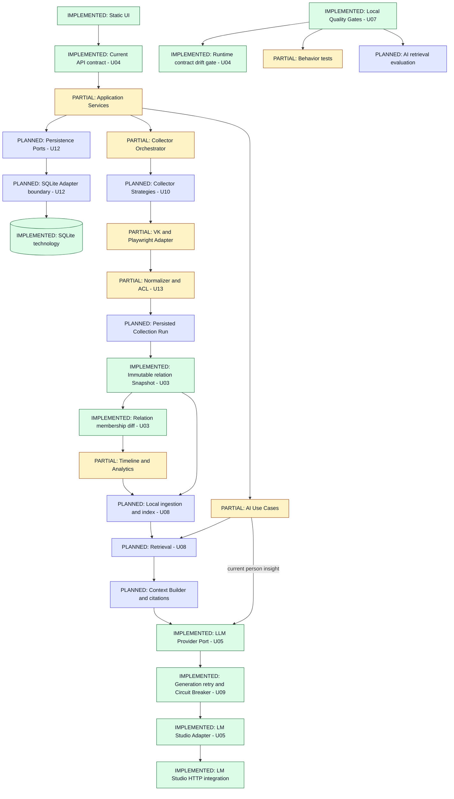

# C4 TARGET — accepted evolutionary design

Baseline 1.0 · 2026-09-23. **TARGET / PLANNED**, не runtime inventory. Сохраняется локальный модульный монолит: boxes ниже — логические ответственности, не microservices. Принятые [ADR](../adr/README.md) не означают завершённую реализацию.

Legend: IMPLEMENTED = существующая technology/component boundary; PARTIAL = существующая capability требует изменений; PLANNED = новый contract/mechanism. Статус указан текстом и цветом. Даже IMPLEMENTED box не доказывает готовность всех целевых стрелок.

U02 уже реализует безопасную schema migration; U03 реализует relation Snapshot и derived membership events; persisted CollectorRun, полный message corpus и application persistence ports остаются target. На схеме не развёрнуты все CRUD стрелки. В target source snapshots неизменяемы, derived metrics/index/reports версионируются отдельно. Валидное полностью наблюдённое пустое состояние отличается от неудачного/неполного сбора; ADR-003/U03 заменяет blanket empty rejection из legacy task T018 поддержкой явно подтверждённого пустого состояния.

LLM port уже отделяет current person insight use case от concrete HTTP — [U05 report](U05_LLM_PROVIDER_REPORT.md). Будущая retrieval цепочка ещё отсутствует: runtime NO_RAG; Ollama NOT IMPLEMENTED. [U09](U09_LLM_RESILIENCE_REPORT.md) реализует generation retry/backoff/jitter и stateful breaker: 3 attempts, max sleep 1.5s, threshold 3 logical failures, recovery 30s и single probe. Это internal defaults, не измеренный SLO: total deadline НЕ enforced; U11 measurement/tuning остаётся целью. Models/health независимы от generation breaker. Hidden remote fallback отсутствует. Vector DB, dense/hybrid/RRF/reranker не выбраны; U08 начинает с измеримого retrieval baseline.

U06 now implements bounded controls across the diagram: loopback endpoint policy, Host/Origin, minimized diagnostics/retention and tracked disclosure guard; broader privacy assurance remains partial. U07 gates планируются; присутствующие tests не дают оснований объявлять CI реализованной. Graph/Export/Scheduler остаются P2 U14–U16 и не обязательны для этого ядра. [Evolution and acceptance](ARCHITECTURE_EVOLUTION.md), [CURRENT](C4_CURRENT.md).

U03 implementation is narrower than the full target chain: relation imports can declare complete sets; the current DOM collector cannot prove completeness and produces INCOMPLETE observations. No automatic index/AI pipeline, retrieval, Graph or immutable messages were added. [U03 evidence](U03_IMMUTABLE_SNAPSHOT_REPORT.md).

U04 implemented current contract governance only: canonical `/api`, no fictitious auth or target endpoints. Future API resources remain planned; full CI/unified runner remains U07. [U04 evidence](U04_API_CONTRACT_REPORT.md).

Local application authentication and encryption are not implemented by U06. Its tested local controls do not promote RAG, Graph, Export or multi-user capabilities. [Security status](SECURITY_PRIVACY_STATUS.md).

U07 runner/architecture fitness are now IMPLEMENTED for current scope; [workflow](../../.github/workflows/quality-gates.yml) is CONFIGURED LOCALLY and remote execution NOT YET VERIFIED. Future retrieval evaluations and broader live/target behavior tests remain PLANNED. No remote PASS, branch protection or deployment claim is inferred from the diagram.
