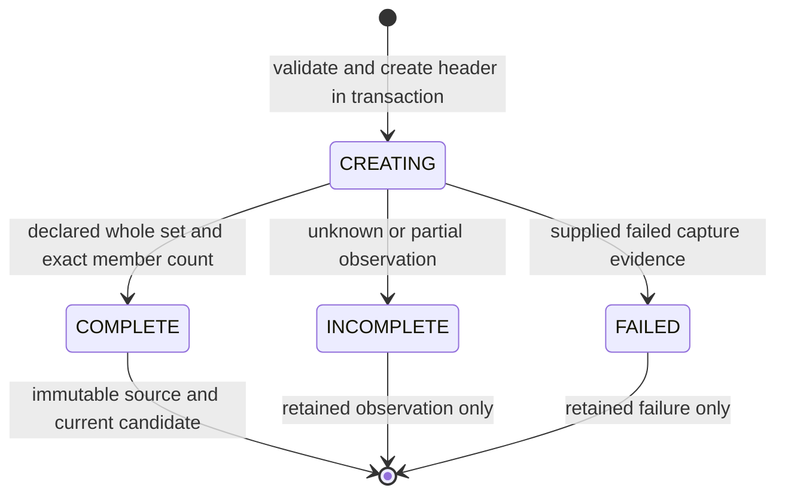
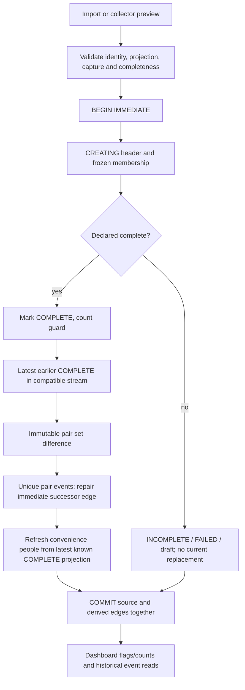

# U03 — Immutable Snapshot Foundation

2026-09-24 · **IMPLEMENTED for friend/follower relation snapshots**. Full message/dialog corpus, attribute/activity diff and snapshot-linked AI remain outside this increment.

## Build gate and history

- Branch: `certification/architecture-upgrade`, used as requested; no new branch.
- Clean start at U09 `32a3d8f286cac2acbb27069a19e65055dacc1d74`.
- Protected `v0.4.2-certification-baseline` → `e34624462fa8ef3cdf56e29ce64cab24aac61411`.
- Protected `v0.5.0-architecture-upgrade` → `32a3d8f286cac2acbb27069a19e65055dacc1d74`.
- U02 `894e86b4d34268cc609db870d7e7ed099a4be395` and U05 `2bf48476b396542fde83b3a8c87f27d4cbf2b335` retained in history. U09 ancestor check passed.
- One intended commit: `feat(data): introduce immutable snapshot foundation`. Retrieve its SHA with `git log -1 --format=%H -- docs/certification/U03_IMMUTABLE_SNAPSHOT_REPORT.md`. No push/merge/amend/rebase/tag movement.

## Problem and before

The prior relation_snapshots table recorded membership by person/type/date, without aggregate identity, completeness, provenance or frozen profile attributes. Multiple same-day captures merged; empty sets had no header and could not replace current state. Repeat imports duplicated events, backdated imports could choose the wrong predecessor, and historical presentation joined mutable people. U02 provided migration safety, U05 the provider boundary and U09 generation resilience, but none supplied immutable relation source state.

## Domain model and field rationale

[snapshot_schema.py](../../app/snapshot_schema.py) adds three tables; [snapshots.py](../../app/snapshots.py) owns capture validation, source writes/reads and derived edges. Existing services delegate relation responsibilities without a Repository framework.

| Entity / fields | Rationale |
|---|---|
| snapshots.id UUID text | collision-safe identity independent of calendar date; returned to callers and referenced by members/events |
| snapshots.sequence INTEGER AUTOINCREMENT | persisted deterministic tie-break when capture times collide; also physical primary key |
| relation_type | one existing application stream for friend or follower; no invented account/tenant scope |
| captured_at, capture_precision | supplied date/time and honest precision; date-only capture remains a date, not fabricated midnight observation |
| source, source_reference nullable | actual manual/file/collector/demo origin and supplied URL or real import job/file/member reference; no fabricated CollectorRun |
| status, completeness | distinguish working, complete, incomplete and failed observations; completeness states DECLARED_COMPLETE/UNKNOWN/PARTIAL |
| item_count | explicit zero-member state and consistency check on COMPLETE transition |
| domain_version=1 | version of this relation projection contract, distinct from DB schema version 2 |
| created_at | local ingestion timestamp, separate from supplied capture time |
| snapshot_people(snapshot_id, external_key) primary key | exact set membership, no duplicate identity within a capture |
| member vk_id nullable, full_name, profile_url, avatar_url | only existing identity/display fields needed to reproduce relation history, frozen in the source row |
| member person_id nullable FK | convenience link to current detail/messages; populated for COMPLETE, unnecessary for incomplete observations; not used to obtain historical attributes |
| people.snapshot_key nullable + UNIQUE index | stable vk:/screen: namespace mapping for new source writes; avoids generating new modulo numeric screen-name surrogates |
| snapshot_events from/to IDs, external_key, event_type | derived logical change uniqueness and source provenance |
| projection_snapshot_id + composite FK to member | additions render current snapshot fields, removals render predecessor fields, never mutable current names/URLs |

No content hash is required: UUID identifies a capture; explicit ID replay compares metadata and canonical identity-sorted members. Missing IDs create distinct captures, even if content/time match. Replaying an explicit ID with identical input returns the same capture; conflicting content is rejected. Replaying without resupplying capture time reuses that capture's timestamp. Same data with a new ID is another observation, whose unchanged membership creates no change events.

External identity is `vk:<positive integer>` or normalized `screen:<name>`. New screen-only projections have NULL numeric VK ID. Existing numeric people can be linked without rewriting legacy membership. Old synthetic identifiers and later screen→numeric aliases are not reconstructed or merged automatically; account switching is not modelled.

## Lifecycle and honest completeness



A draft may remain CREATING, but never participates in current selection. COMPLETE requires DECLARED_COMPLETE, exact count and current person linkage. Finalized headers/members reject UPDATE/DELETE and replacement insertion; corrected captures need new identities. There is no promotion UI or retention/deletion workflow. SQL guards protect normal DML, not a database owner capable of replacing schema.

Manual/API and structured file relation import is explicitly a declaration that the submitted list is a complete replacement set. `people: []` is valid; missing people, invalid/duplicate identity and invalid fields are rejected. Completeness is not independent verification of upstream VK truth. JSON metadata can state UNKNOWN/PARTIAL or FAILED and is honored. CSV/TSV imports declare their supplied set; HTML extraction stays UNKNOWN because regex anchors cannot establish full coverage.

Current DOM collection cannot prove completeness. Friend/follower preview saves are always UNKNOWN/INCOMPLETE, even if an unsupported completeness claim is present. They retain observed projection and source URL without updating people/current counts or deriving removals. New previews have a UUID and offset timestamp; re-saving the same preview reuses its ID. The existing UI now explains that the observation was saved and current relations were not changed. Dialog persistence remains separate. Empty DOM failure is still not treated as confirmed empty; explicit complete empty imports are supported.

Unexpected validation/SQL/derivation failures roll back all work, rather than persisting a misleading COMPLETE or a fabricated failure run. FAILED rows are retained only when supplied as such. Demo seed relations now use the same foundation; any v2 snapshot, including empty or incomplete, prevents automatic reseeding based merely on an empty people table. A full explicit demo-mode redesign remains U13.

## Provenance and ordering

All precise timestamp inputs normalize to UTC. Existing naive preview timestamps use the application-local timezone convention for compatibility; new collector timestamps include an offset. Date-only input is stored as `YYYY-MM-DD` with date precision, ordered before timestamps on that date. If no capture time is supplied, the recorded instant is import acceptance time, not an invented earlier VK observation. created_at always records ingestion. The convention is documented; old missing timezone/precision cannot be recovered.

Within each relation stream, order is `(captured_at, sequence)`. Tied captures remain distinct and insertion sequence fixes their order. Predecessor/current/successor selection considers only COMPLETE. Sources may differ (manual/file/collector) without creating separate relation streams; the application has no reliable account scope to add.

File provenance uses an actual `import_job:<id>:<stored filename>` reference; ZIP members also include their member path. Each supported archive member is an independent capture, not a union of lists. ZIP imports retain the existing per-file transaction behavior: archive-wide atomicity and expanded-size limits remain separate work. No source contents are logged.

## Write/read path and transaction boundary



Public creation starts BEGIN IMMEDIATE; internal seed composition requires an existing transaction. Validation may run after obtaining the reservation but before source writes. Source finalization, event repair and convenience projection updates share that transaction. A failure after finalization or during event derivation leaves the prior database dump unchanged. Concurrent same-ID writers serialize through SQLite and return one capture. No async worker/event bus was added.

Historical snapshot reads use header and snapshot_people directly. Dashboard relation counts and list_people flags select latest COMPLETE v2 per relation. Legacy current membership is a clearly tested fallback only until that stream has its first COMPLETE v2; an incomplete v2 observation does not disable it. Once a COMPLETE exists, even empty, stale legacy membership cannot override it. First v2 capture establishes a baseline rather than deriving changes against legacy evidence of unknown completeness.

New timeline/dashboard/person-detail events use immutable projection fields and include source pair IDs. Legacy events are preserved and labelled `legacy_unknown`; their old mutable-name limitation remains. Event IDs in combined reads use snapshot:/legacy: prefixes to avoid collisions; existing UI fields and route paths remain supported. New source data does not emit the previous same-day friend_to_follower inference, because independent streams do not prove that transition. Legacy transition events remain readable.

## Diff, backdated policy and event idempotency

Explicit pair diff reads only the two immutable compatible COMPLETE sets, returning identity-sorted added/removed projections. Unchanged membership yields no events; attribute-only changes are retained in the source but do not generate new event types in U03. First observation can report its set as added relative to empty for count compatibility, but creates no observed-change event without a predecessor.

**Policy A:** for A Jan1, C Jan3, then B Jan2, derive A→B and recompute C against B in the same transaction; delete obsolete A→C derived events. Other edges and all source rows remain unchanged. Inserting before the first observation correctly converts the old baseline into a successor edge. Backdated profile values do not regress the current convenience projection: it is refreshed from the latest COMPLETE occurrence of each touched identity across relation streams.

UNIQUE(from_snapshot_id, to_snapshot_id, event_type, external_key) plus INSERT OR IGNORE prevents duplicate pair events. Replay leaves event IDs unchanged when their pair is unchanged. A repaired pair can receive new event IDs; derived event IDs are not immutable historical facts. No append-only log or Event Sourcing claim is made.

## Migration and legacy policy

Previous canonical schema: 1. Current: **2**. Existing [U02 migration framework](../../app/migrations.py) keeps BEGIN IMMEDIATE, read-only-source SQLite backup, rollback, defaults and future-version safeguards. v1 is validated before adding tables/indexes/triggers and nullable people.snapshot_key; no old data is deleted or backfilled. Legacy relation tables retain exactly their old dates/membership/events. No precise times, source runs or COMPLETE status are fabricated.

Recognized v0 upgrades still add the U02 dialog columns, then the v2 foundation, in one transaction. Fresh DB initializes directly to current v2. Existing upgrades create `schema-v<from>-to-v2-<UTC>-<UUID>.db` before changes, including committed WAL data. Backups are never overwritten; failed copies remain subject to the existing operator-inspection policy. Refusal blocks mutation; failure after DDL/version/defaults rolls back. Current initialization validates snapshot SQL objects and FK integrity; future version is refused without mutation.

The 14 U02 tests are retained, with only current-version/future-error/backup-filename expectations advanced to v2. New v1 fixtures verify every old table's rows, readable exact pre-state backup, no fabricated snapshot rows, repeated startup, fresh v2/FK, refusal and DDL rollback. Schema-trigger drift is rejected.

## Test evidence

[tests/test_snapshots.py](../../tests/test_snapshots.py): **34 new unittest cases**. Multiple requirement IDs are covered by shared methods/subtests; they are not double-counted.

| Required evidence | Behavior | Result |
|---|---|---|
| SNP-001, SNP-007 | same timestamp/day distinct UUIDs, stable sequence/predecessor | PASS |
| SNP-002, EVT-003 | later people name/avatar changes cannot alter snapshot/event historical fields | PASS |
| SNP-003 | exact membership, no same-day union, correct dashboard set | PASS |
| SNP-004, EVT-005 | explicit zero-member COMPLETE, removals persist once, current count zero | PASS |
| SNP-005 | FAILED/CREATING/INCOMPLETE excluded, no partial projection promotion | PASS |
| SNP-006 | supplied source/reference/capture preserved; date precision explicit | PASS |
| DIFF-001…005 | add/remove/both empty directions/unchanged exact sets and events | PASS |
| DIFF-006 | three same-day captures compare sequentially | PASS |
| DIFF-007 | friend/follower isolation and incompatible pair rejection | PASS |
| DIFF-008, EVT-001 | same pair processed three times, stable diff and event rows/IDs | PASS |
| DIFF-009 | predecessor ignores incomplete/failed/draft rows | PASS |
| EVT-002 | from/to and historical projection references; DB duplicate insert rejected | PASS |
| EVT-004 | backdated A/C then B repairs exactly affected edges; source rows unchanged | PASS |
| MIG-SNP-001 | v1→v2 all old values/IDs preserved, exact backup and FK clean | PASS |
| MIG-SNP-002 | backup refusal and after-DDL rollback; U02 invariants retained | PASS |
| MIG-SNP-003 | three repeat initializations unchanged/no extra backup | PASS |
| MIG-SNP-004 | legacy retained, no invented v2 provenance/completeness | PASS |
| MIG-SNP-005 | fresh v2, FK clean, future-version refusal without mutation | PASS |
| Additional invariants | SQL immutability/replacement guard, atomic event failure, replay conflict/concurrency, namespaced screen identity, legacy precedence | PASS |
| Compatibility | friend/follower preview save/replay, dialogs, empty JSON/file metadata, HTML uncertainty, actual API dashboard/timeline/person detail, seed after empty | PASS |
| Architecture and volume | local source module dependency check, message_stats explicitly not scoped, two 1000-member captures | PASS |

## Regression and performance sanity

| Suite | Count | Result |
|---|---:|---|
| U03 new | 34 | PASS |
| U09 resilience | 25 | PASS |
| U05 provider/API/settings | 26 | PASS |
| U02 migration | 14 | PASS |
| Existing unittest | 18 | PASS |
| Standard discovery total | **117** | **PASS, zero failures/errors** |
| Additional existing v043 functions | **8** | **PASS** |

The full gate measured **0.0756 s** for two synthetic 1,000-member captures (2,000 stored memberships total, 1,500 distinct people) plus explicit pair diff, producing 500 additions and 500 removals. Other local runs were approximately 0.074–0.080 s. Python 3.13.2 / local Windows virtual environment / temporary SQLite, no network. This is a single-process sanity measurement, not a benchmark or capacity/SLA claim; there is no timing threshold assertion.

Writes use executemany; identity lookup/current projection reads batch at 400 keys; ordering, identity and target-edge indexes support the queries. No per-member SELECT loop is used. Growth over long histories, disk budgets, multi-writer stress and hardware-labelled latency remain U11.

Commands (repository root, existing dependencies):

```powershell
.\.venv\Scripts\python.exe -B -m unittest discover -s tests -p test_snapshots.py -v
.\.venv\Scripts\python.exe -B -m unittest discover -s tests -p test_llm_resilience.py -q
.\.venv\Scripts\python.exe -B -m unittest discover -s tests -p test_ai_provider.py -q
.\.venv\Scripts\python.exe -B -m unittest discover -s tests -p test_migrations.py -q
.\.venv\Scripts\python.exe -B -m unittest discover -s tests -v
.\.venv\Scripts\python.exe -B -c "import runpy; ns=runpy.run_path('tests/test_v043_organization_source.py'); tests=[f for n,f in ns.items() if n.startswith('test_') and callable(f)]; [f() for f in tests]; print(len(tests), 'additional existing PASS')"
```

New tests patch data/import/backup paths to temporary directories and use inherited network/sleep guards. In-process TestClient does not run production lifespan/startup. Two pre-existing v031 unclosed-file ResourceWarnings remain warnings. Standard runner still omits the eight plain functions; unified runner/CI remains U07. No dependency was installed or changed.

## Files, safety and limits

Runtime: new snapshots.py/snapshot_schema.py; migration version/wiring; services relation reads/writes; import metadata/empty handling; minimal collector preview identity/time metadata; seed relation writes and empty-state guard. Existing frontend gets one honest incomplete-save notice. New U03 tests and three expectation edits in U02 tests. Required certification/ADR pages and four target-document scope banners updated; ADR-005 evolution and the two navigation indexes aligned to remove stale implementation claims. No unrelated AI/provider/resilience, message_stats schema, dialog schema/flow, route redesign, requirements or runner work.

User database was never migrated or written. Its SHA-256 remains `0c20c00abed8fae1d154db1c0f04a45ba2512dfdd6f6c3d5e440422e5d459652`. No real DB/backups/profile/previews/imports/logs/secrets belong in the commit. No live VK/LM Studio/Chromium or network calls occurred. Protected history remains unchanged.

**Message_stats snapshot-scoped: NO. RAG: NO_RAG.** Provider/AI-boundary DIP and U09 resilience remain implemented; global DIP remains partial. U03 proves relation foundation, not all FR-2/FR-7/FR-8 or a full source corpus. Legacy historical attributes cannot be reconstructed; screen/numeric aliases and account changes are not resolved. Completeness remains a declaration for structured import; collector evidence is still insufficient. Snapshot browser/export/retention and archive-wide import atomicity are not added.

Certification value: executable historical immutability and causal pair provenance, proven by failure/replay/ordering/empty/migration tests, instead of pattern names alone. Next recommendation only: **U04 actual API contract**, then address U07 collection/CI and U11 measured NFR separately. None is started here.
