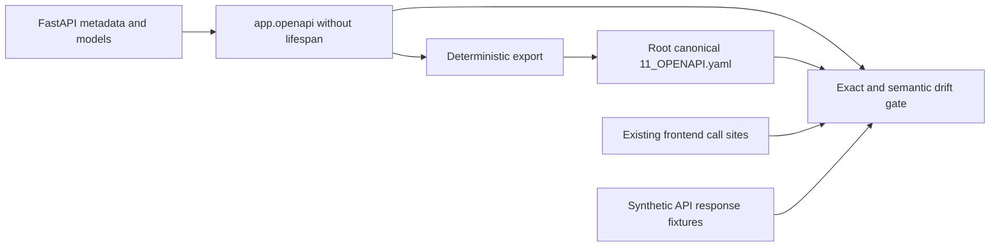

# U04 — Runtime API Contract Alignment and Automated Governance

2026-09-24 · **IMPLEMENTED within the current runtime API scope.** No live server, VK, LM Studio or Chromium execution.

## Provenance and pre-build gate

- Branch: `certification/architecture-upgrade`, initially clean.
- Start/U03: `1c619259691f5ddca232f1d67142bdf14c0be47b`; ancestry gate passed.
- Protected baseline tag: `v0.4.2-certification-baseline` → `e34624462fa8ef3cdf56e29ce64cab24aac61411`.
- Protected architecture tag: `v0.5.0-architecture-upgrade` → `32a3d8f286cac2acbb27069a19e65055dacc1d74`.
- U02/U05/U09/U03 history retained; no amendment, rebase, tag movement, push or merge.
- One atomic commit: `feat(api): align runtime OpenAPI contract`. Its SHA is available via `git log -1 --format=%H -- docs/certification/U04_API_CONTRACT_REPORT.md`.

## Problem and before

Root YAML described a future 18-operation API at `/api/v1`, with global Bearer security and largely generic schemas. Runtime had `/api`, no HTTP authentication, different resources and response/error semantics. Neither a successfully parsed target document nor the presence of generated FastAPI docs proved alignment. U03 added immutable relation behavior, and U05/U09 provider/resilience behavior also needed truthful API coverage.

The [runtime inventory](U04_RUNTIME_API_INVENTORY.md) was created before editing the contract, using current decorators, frontend calls, services/collector/importer/AI code and app.openapi without startup. It retains pre-edit generated IDs/handler locations and adds the final shape index; pre-edit line numbers identify the U03 revision, while handler names remain current.

## Inventory and alignment counts

| Measure | Verified count / outcome |
|---|---|
| Runtime application operations | 30: 29 public `/api` operations + 1 internal HTML shell |
| Canonical operations | 30, exact coverage; no phantom or undocumented public operation |
| Frontend | 21 literal/template call sites, including three concrete values of collector `{kind}`; all mapped to runtime/canonical |
| Explicit stable operationIds | 30, unique nonempty snake_case |
| Explicit response-model operations | 27 public operations; remaining two public settings operations retain typed string mappings |
| Component schemas | 32 including framework multipart/validation components |
| Old target operations reclassified | All 18 old URLs archived/non-canonical; 14 lack a normalized runtime method/path counterpart; four match capabilities after prefix normalization only |
| Schema/contract mismatch categories fixed | 9: prefix/server, operation coverage, operationIds, request descriptions/requiredness, response shapes, success status semantics, errors, security, ownership/drift governance |
| API route additions/removals / frontend changes | 0 / none |

The shell is `GET /`; static mount, `/openapi.json`, `/docs`, `/docs/oauth2-redirect` and `/redoc` are framework infrastructure and excluded from the 30 application count. Public means callable by local API consumers, not internet deployment or authorization. API-only organization diagnostics remain public and included; they are not hidden from the contract by classification.

## Canonical ownership and versioning decision

Choose **strategy A: FastAPI-generated canonical schema**. Author [route metadata](../../app/main.py), [response models](../../app/api_models.py) and [request/error metadata](../../app/api_contract.py); [export](../../scripts/export_openapi.py) deterministically serializes app.openapi to [root 11_OPENAPI.yaml](../../11_OPENAPI.yaml). The artifact is reviewed and committed. Exact comparison is appropriate because it is generated, with sorted keys and stable explicit IDs.

JSON-form YAML 1.2 permits strict standard-library parsing and deterministic export without adding a production or test dependency. Existing local PyYAML independently parsed the same artifact. The duplicate feature YAML is the already-existing archived TARGET proposal, not another editable canonical truth; its old structural weaknesses are not a runtime-contract claim. Duplicate guides/feature contracts and target test specifications point to the root runtime guide.

Keep `/api` for frontend and existing clients. No alias or `/api/v1` migration has practical value in this scope. Future incompatible changes require an explicit compatibility/versioning decision. The default server is honest loopback `http://127.0.0.1:8765`; no fictitious production HTTPS server or developer machine path appears in canonical server configuration. OpenAPI 3.1.0 and existing app/health version 0.4.2 are distinct from DB schema version 2.



## Requests, responses and compatibility changes

Handler names, route paths, verbs, service calls and status mappings are preserved. Explicit snake_case operationIds replace generated names as metadata. API consumers are unaffected; pre-U04 generated client method names may change because no stable explicit IDs previously existed. No client generation was run or claimed.

Requests retain dict-based business validation rather than introducing incompatible framework 422 responses. Body metadata records actual required fields, enums where enforced, accepted coercions, defaults and service-level 400 behavior. Settings still stringify three keys and ignore unknown keys; organization options still accept arbitrary JSON, with only objects passed to collection. Limit query parameters use Annotated Query descriptions while preserving Python defaults: integers clamp instead of failing bounds validation. Multipart fields retain their original requiredness. Collector kind/target remain service-validated strings, not newly restrictive framework enums.

Responses now describe health, dashboard, people/detail, changes, message periods, snapshot/save/file results, model discovery/insight, collector state/preview/classification/jobs and dialogs. Models allow extension fields and exclude unset defaults to preserve vendor metadata, diagnostics and optional result absence. Nullable SQLite fields remain nullable; persisted insight evidence_json/cautions_json remain strings, not invented decoded arrays. Relation/dialog preview and organization result variants are both supported and tested. Diagnostic item/report/progress contents remain extensible; this is not exhaustive typing of every DOM diagnostic key.

No runtime service/collector/AI/data logic was redesigned. Some malformed non-string snapshot UUID input can still reach an unhandled 500; the contract and guide document this existing boundary rather than claiming universal input validation. Response validation can now expose unexpected server shape drift as 500, which is documented and covered by representative fixtures; live upstream collector/provider shape verification remains outside this build.

## Errors and security truth

Mapped HTTPException bodies use shared APIError `{detail: string}`. Framework validation uses its 422 detail-array schema. Unexpected server failures remain text/plain `Internal Server Error`; there is no new catch-all JSON middleware. Explicit collector startup failures use JSON 500. Missing person/preview/job are 404. Import/domain/collector errors are 400 where handled. Model discovery/test and insight provider/configuration/output/circuit failures remain controlled 503. All successes are 200, including queued/busy/pending organization jobs; 202/409 are not invented.

No authentication exists in runtime and none is required by canonical security. Collector `check-auth` checks the separate VK browser session, not the caller. Default loopback is a deployment boundary, not an enforceable access/privacy policy. U06 remains separate; no auth gateway, Bearer token validation, user roles or multi-user capability was added. Existing raw diagnostic/path fields remain, and examples/tests contain synthetic values only.

## U03 and U05/U09 exposure

U03 is exposed through existing relation import/save, dashboard/people flags, changes and person detail. Explicit empty COMPLETE replacement, historical person projection, pair provenance, backdated event repair and INCOMPLETE exclusion are documented and covered. There is no snapshot list/read API invented for the old target contract. message_stats and AI remain outside snapshot reproducibility; RAG remains NO_RAG.

U05 uses the existing provider port for insight and models/test. U09 controlled 503 includes circuit-open behavior without provider generation; model discovery remains separate. The guide records bounded attempt/sleep defaults without claiming a total request deadline. No new retry settings, provider selection, fallback, AI chat or report routes were introduced.

## Frontend compatibility and drift gate

All 21 static/app.js API call sites are inventoried. The gate recognizes the small existing `api` and `collectorAction` wrappers, template person IDs and concrete collector kinds. It fails closed on unknown dynamic call syntax or new direct fetch usage rather than silently omitting it. Adding a new wrapper requires updating the reviewed extractor/inventory. External VK profile/avatar URLs are not application API calls.

Fresh app.openapi generation avoids stale schema cache. Exact artifact comparison catches changes in method/path, parameters/defaults, operationIds, request/response/error components and security. Separate semantic tests assert runtime/public/frontend coverage, required path params, no target resources/auth and meaningful core response schemas. Eight deliberate schema mutation families and a new fetch mutation prove gate failure. Behavior tests exercise actual handlers with temporary storage, fake providers and mocked collector operations; they validate success/error payloads against the canonical subset. They do not use production lifespan or Uvicorn.

## Test evidence

| Required ID / gate | Evidence | Result |
|---|---|---|
| API-CONTRACT-001 | enumerate 30 routes, fresh schema, no startup/DB | PASS |
| 002 | all 21 frontend call sites match method/template runtime/canonical | PASS |
| 003–005 | no phantom/target route, no missing public operation, exact methods | PASS |
| 006–007 | path params required/matched; explicit stable unique IDs | PASS |
| 008–009 | request/success/error definitions match runtime; core responses typed | PASS |
| 010 | missing/non-object body, domain invalid input, bad path/query types, multipart/query requiredness | PASS |
| 011 | representative person/preview/job 404 and models/insight/circuit 503 | PASS |
| 012 | no global/operation security or runtime security dependency | PASS |
| Export and mutation checks | exact deterministic artifact, local refs, deliberate schema/UI drift rejection, export --check without startup | PASS |
| API behavior | health/shell/settings, U03 empty/provenance/current reads, file/ZIP/message import, dialogs, collector mocks, organization preview/jobs, FakeProvider insight and circuit-open | PASS |
| Error behavior | JSON startup 500 and default text/plain unhandled 500 | PASS |

| Suite | Count | Result |
|---|---:|---|
| New U04 | 23 (13 contract + 10 behavior cases) | PASS |
| U03 | 34 | PASS |
| U09 | 25 | PASS |
| U05 | 26 | PASS |
| U02 | 14 | PASS |
| Existing unittest | 18 | PASS |
| Standard discovery total | **140** | **PASS; zero failures/errors** |
| Additional existing v043 plain functions | **8** | **PASS, separately invoked** |

Commands, repository root and existing environment:

```powershell
.\.venv\Scripts\python.exe -B scripts/export_openapi.py --check
.\.venv\Scripts\python.exe -B -m unittest discover -s tests -p test_api_contract.py -v
.\.venv\Scripts\python.exe -B -m unittest discover -s tests -p test_snapshots.py -q
.\.venv\Scripts\python.exe -B -m unittest discover -s tests -p test_llm_resilience.py -q
.\.venv\Scripts\python.exe -B -m unittest discover -s tests -p test_ai_provider.py -q
.\.venv\Scripts\python.exe -B -m unittest discover -s tests -p test_migrations.py -q
.\.venv\Scripts\python.exe -B -m unittest discover -s tests -q
.\.venv\Scripts\python.exe -B -c "import runpy; ns=runpy.run_path('tests/test_v043_organization_source.py'); tests=[f for n,f in ns.items() if n.startswith('test_') and callable(f)]; [f() for f in tests]; print(len(tests), 'additional existing PASS')"
```

Validation: stdlib JSON parse (YAML 1.2 subset), installed PyYAML parse, FastAPI OpenAPI structural model, local $ref resolution, generated comparison and synthetic behavior fixtures PASS. **Formal OpenAPI spec validator: NOT AVAILABLE.** No Swagger client generation, exhaustive JSON Schema validation or live E2E claim. The small fixture checker is intentionally limited to the emitted schema subset. Existing two v031 ResourceWarnings remain warnings; unified collection of eight plain tests and CI remain U07. Requirements and dependency installation are unchanged.

## Files, safety and limitations

Runtime changes are limited to main.py metadata/response wiring, new api_models.py and api_contract.py. Supporting changes: export script, new contract tests, root OpenAPI/guide, required certification documents/report/inventory and minimal links/banners on duplicate guides/target test specifications. No frontend, DB/schema migration, services, imports, collector, AI/provider/resilience or dependency changes are required.

The user DB was never opened by build/test SQLite or migrated/written; SHA-256 remains `0c20c00abed8fae1d154db1c0f04a45ba2512dfdd6f6c3d5e440422e5d459652`. No real data, DB/backups/profile/previews/logs/secrets are staged. Protected tags and U03 ancestry are retained. No network, live VK, LM Studio or Chromium execution occurred.

Contract governance now provides an executable review boundary: future runtime metadata/route changes fail until the canonical artifact and compatibility evidence are updated. It is not authentication, comprehensive privacy enforcement, a unified CI system or a new target API implementation. Defaults/coercions and variable diagnostic structures remain existing behavior, explicitly documented. Next recommendation only: **U06 privacy/access hardening**; U07 runner/CI remains separate. Neither is started here.
