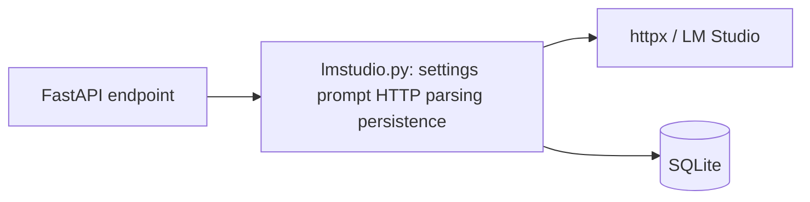
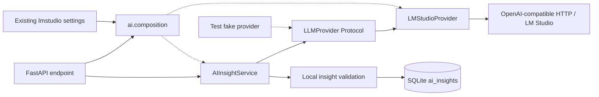

# U05 — LLM Provider Port + LM Studio Adapter

Date: 2026-09-23. **Implementation / regression: PASS.** Branch: `certification/u05-llm-provider`.
Start SHA / completed U02: `894e86b4d34268cc609db870d7e7ed099a4be395`.
Protected baseline tag `v0.4.2-certification-baseline`: `e34624462fa8ef3cdf56e29ce64cab24aac61411`.
Initial worktree clean; U02 ancestry and baseline tag verified. Commit policy: one atomic `feat(ai): introduce LLM provider abstraction`; the final console report supplies its SHA. No push/merge/amend/retag.

## Problem / previous architecture

The historical [pattern audit](02_PATTERN_INVENTORY.md) found working concrete HTTP wiring but no replaceable provider boundary. `main` imported concrete LM Studio functions; `lmstudio.py` combined settings, prompt/context, HTTP, extraction, JSON parsing and SQLite persistence. Server JSON Schema did not guarantee local output validation.



## New architecture



All boxes inside `app` remain modules in the existing process. No worker, queue, plugin framework or repository abstraction. API → use case → provider is the production path; the interface is exercised, not merely declared.

## Provider port and normalized contracts

[LLMProvider](../../app/ai/provider.py) is a structural `Protocol` with only `list_models()` and `generate(request)`. Protocol avoids mandatory inheritance; the test fake implements the same contract without inheriting the production adapter or port. Connection testing already means model discovery, so no speculative health/inference-readiness capability was added.

[Contracts](../../app/ai/contracts.py): Message(role/content), StructuredOutput(name/JSON schema), GenerationRequest(model/messages/temperature/optional structured output), GenerationResult(content/model/provider), ModelInfo(id/optional metadata). HTTP response objects, status codes and choices/data envelopes stay inside the adapter. Optional model metadata preserves existing model descriptors in the models API; the use case reads only normalized IDs. A future adapter must map its descriptors into this boundary; this is not a claim of universal provider compatibility.

## LM Studio adapter

[LMStudioProvider](../../app/ai/providers/lmstudio.py) owns base URL, `/models`, `/chat/completions`, httpx, timeouts 8s/120s, message/schema mapping, non-streaming request, response extraction and error translation. `httpx.MockTransport` can be injected. It imports neither Person services, SQLite nor FastAPI and constructs no relationship prompt. A response model ID is normalized, falling back to the requested model if absent; API/persistence retain the historical selected-model convention.

## Composition and use case

[composition.py](../../app/ai/composition.py) is the sole production location constructing LMStudioProvider. `get_provider` uses existing base URL; `get_insight_service` supplies that port and existing model/temperature to AIInsightService. API calls the factories within its existing exception boundary. Only LM Studio exists, so no `llm_provider` UI setting or provider registry was introduced.

[AIInsightService](../../app/ai/service.py) builds the existing Russian prompt, selects an explicit model or the first discovered model, requests structured output, validates locally and persists only after success. Fixed context remains name + latest message metrics + first ten relationship events. Prior insights, profile URLs and other person fields are not added. SQLite persistence is still direct SQL in this layer; **DIP is implemented only for provider transport, not globally**.

Settings SQL/allowlist move unchanged to [ai/settings.py](../../app/ai/settings.py). [app/lmstudio.py](../../app/lmstudio.py) is a small compatibility facade for previous Python imports; production `main` no longer imports it. Its store_insight re-export also validates before insertion.

## Error model

| Error | Adapter translation | Runtime action |
|---|---|---|
| ProviderTimeoutError | httpx timeout | one attempt, propagate |
| ProviderUnavailableError | connection/request failure; HTTP 429 or 5xx | one attempt, propagate |
| ProviderProtocolError | invalid URL/protocol or other rejected HTTP status | one attempt, propagate |
| ProviderResponseError | malformed JSON/envelope/model list/completion/response encoding | controlled failure |
| InsightValidationError | malformed generated JSON or invalid insight fields | no persistence |
| AIConfigurationError | non-numeric/non-finite temperature | no provider generation or persistence |

Provider error messages omit URL, prompt and raw response/transport text; adapter suppresses raw exception chaining in displayed tracebacks. Expected AI failures still return HTTP 503 with a `detail` string. Unexpected exceptions also use generic detail rather than exposing raw data. This deliberately normalizes error text; success shapes, error status/envelope and missing-person 404 remain compatible. Error classes provide a seam for later U09; there is **no retry/backoff/jitter/breaker/fallback/cache**.

## Structured validation and persistence guard

Stdlib validation enforces the existing schema locally: exactly five required fields; status in strengthening/stable/weakening/insufficient_data; numeric confidence within [0,1], excluding bool/NaN/infinities; string summary; evidence/cautions arrays containing only strings; no extra fields. Invalid JSON, root type, missing field, type, enum or range becomes controlled InsightValidationError. SQLite insert is reached only after validation, and remains a single transaction. No new dependency or DB migration.

## Backward compatibility

| Surface | Preserved behavior / evidence |
|---|---|
| GET `/api/lmstudio/models` | List of model dictionaries, including optional descriptor attributes; real composition + mocked adapter transport tested |
| POST `/api/lmstudio/test` | `{ok, models_count, models}`; uses discovery, not inference readiness; success/failure tested |
| POST `/api/people/{person_id}/insight` | `{id, status, confidence, summary, evidence, cautions, model}`; synthetic persistence, 404 and controlled 503 tested |
| GET/PUT `/api/settings` | Three existing lmstudio_* keys/defaults/string values and allowlist preserved; unknown llm_provider remains ignored |
| UI / schema / migrations | No frontend changes, schema changes or U02 edits; no new routes |

Malformed provider responses previously accepted by loose parsing are now rejected as required by U05. No live LM Studio request is claimed.

## Tests and regression

[tests/test_ai_provider.py](../../tests/test_ai_provider.py) uses standard unittest discovery, fake providers, MockTransport and in-process TestClient. TestClient is not entered as a lifespan context: production startup/seed never runs. DB/data/import/backup paths are temporary; the new suite blocks socket.create_connection and HTTPTransport.handle_request to fail accidental network attempts.

| Required test | Evidence | Result |
|---|---|---|
| LLM-PORT-001 | Fake substitution, identical context fields/event limit, model selection | PASS |
| LLM-PORT-002 | POST URL/model/temp/messages/schema/stream mapping; 120s timeout | PASS |
| LLM-PORT-003 | GET URL, normalized models and preserved metadata; 8s timeout | PASS |
| LLM-PORT-004 | Connection failure mapped to unavailable on both operations | PASS |
| LLM-PORT-005 | Read timeout mapped; exactly one call, no retry | PASS |
| LLM-PORT-006 | Bad JSON/envelopes/choices/content/model lists controlled | PASS |
| LLM-PORT-007 | Valid output persists with compatible return, explicit model/temp | PASS |
| LLM-PORT-008 | Invalid JSON/non-object output rejected, count unchanged | PASS |
| LLM-PORT-009 | Every required field tested missing; no insertion | PASS |
| LLM-PORT-010 | Enum/range/types/extra fields rejected; all statuses and confidence 0/1 accepted | PASS |
| LLM-PORT-011 | Models API through actual composition and mocked HTTP | PASS |
| LLM-PORT-012 | Insight API through fake composition, correct persistence/404 | PASS |
| LLM-PORT-013 | GET/PUT settings compatibility and ignored unknown keys | PASS |
| LLM-PORT-014 | Import fitness; all new core/API tests run with network guards | PASS |

Additional new cases cover HTTP/protocol failures, connection-test API, invalid output/settings 503, no-model/provider-failure persistence guard, composition settings and compatibility store guard. `ProviderContract` is a reusable mixin with the same three normalized-model/result/failure tests run against both the fake and the mocked LM Studio adapter (six tests). A future adapter supplies make_provider with deterministic success/failure fixtures; Ollama is not implemented.

Commands (repository root, existing Python 3.13.2 `.venv`, no installation):

```powershell
.\.venv\Scripts\python.exe -B -m unittest discover -s tests -p test_ai_provider.py -v
.\.venv\Scripts\python.exe -B -m unittest discover -s tests -p test_migrations.py -v
.\.venv\Scripts\python.exe -B -m unittest discover -s tests -v
.\.venv\Scripts\python.exe -B -c "import runpy; namespace = runpy.run_path('tests/test_v043_organization_source.py'); tests = [(name, test) for name, test in namespace.items() if name.startswith('test_') and callable(test)]; [test() for name, test in tests]; print('Additional existing tests:', len(tests), 'PASS')"
```

**Results:** U05 26 PASS; U02 14 PASS; existing unittest 18 PASS. Standard discovery **58 PASS**. Additional existing functions **8 PASS separately**. Failures/errors **0**. Two pre-existing ResourceWarning messages in test_v031 source readers remain; they are not test failures. U07 collection/CI is not solved.

## Architecture fitness

AST import checks verify service has no httpx/providers/composition/lmstudio/FastAPI imports; adapter has no FastAPI/Person services/DB/settings imports; port has no concrete imports; API has no direct lmstudio/httpx import. Fake substitution and production API mock tests complement these static checks with behavioral evidence. Only composition constructs the concrete provider in application code.

## Privacy impact

No network, live LM Studio, VK or Chromium used. No prompt/person/raw-response logging or telemetry added. Default remains `http://127.0.0.1:1234/v1`; arbitrary remote endpoint configuration remains known U06 debt. Existing context is not expanded. User DB was not opened by application/tests, migrated or otherwise modified; only file hashing verifies its unchanged SHA-256 `0c20c00abed8fae1d154db1c0f04a45ba2512dfdd6f6c3d5e440422e5d459652`. All persistence evidence uses synthetic temporary SQLite.

## Files changed

- New runtime modules: `app/ai/__init__.py`, `contracts.py`, `provider.py`, `service.py`, `settings.py`, `composition.py`, `providers/__init__.py`, `providers/lmstudio.py`.
- API wiring `app/main.py`; compatibility facade `app/lmstudio.py`.
- New `tests/test_ai_provider.py`; existing tests/U02 source remain unchanged.
- Nine required updates: Architecture Status, Architectural Patterns, C4 Current/Target, Traceability, Technical Debt, Upgrade Backlog, ADR-004 and root README; this new report.
- No frontend, requirements, schema, runtime artifacts or user data changes.

## Known limitations / certification value / next upgrade

U05 proves a used Ports & Adapters seam, narrow AI DIP, safe error normalization and local structured validation. LM Studio behavior is verified by mock HTTP contracts, not live inference/model quality. Connection test proves discovery only. Synchronous calls retain existing timeouts, not a whole-operation deadline. Only one production provider; structural typing alone cannot guarantee every future implementation behaves correctly, hence reusable behavioral contracts.

Provider abstraction / LM Studio adapter / DIP AI boundary: **IMPLEMENTED**. RAG: **NO_RAG / PLANNED**. Retry/Backoff/Jitter/Circuit Breaker: **NOT IMPLEMENTED / PLANNED**. Ollama: **NOT IMPLEMENTED**. Direct SQL, missing snapshot provenance and arbitrary endpoint policy remain separate work. Historical audit reports retain their original findings.

Next recommendation: **U03 immutable Snapshot source of truth**, beginning with empty/repeated/same-day/backdated regression fixtures. U03/U08/U09 are not implemented by this change.
