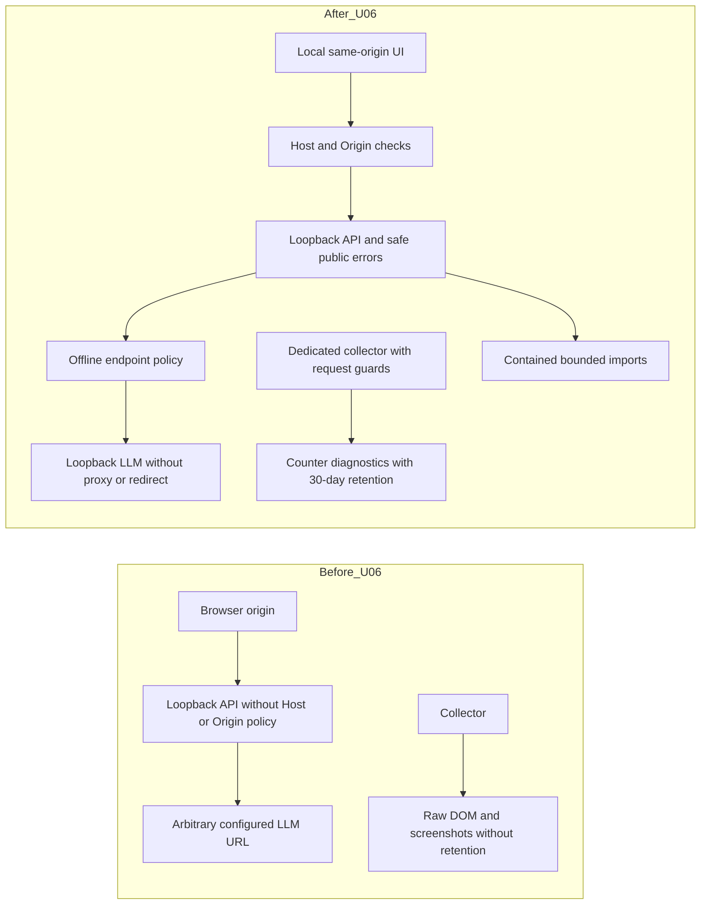

# U06 — Privacy & Access Hardening

2026-09-24 · **IMPLEMENTED in bounded local single-user scope. Overall privacy assurance: PARTIAL.**

## Problem and protected baseline

Local-first defaults previously allowed arbitrary LLM URLs, raw browser diagnostic captures, weak import filename handling and raw public exceptions. A loopback bind alone did not distinguish local browser origins. U06 makes these boundaries explicit and tests them offline.

Work uses only `certification/architecture-upgrade`, starting from U04 `5223de98daee53f606623a16d867835599cbd9f5`. The pre-build worktree was clean; U04 ancestry and protected tag targets were verified. Protected baseline: `v0.4.2-certification-baseline` → `e34624462fa8ef3cdf56e29ce64cab24aac61411`; protected U09/v0.5: `v0.5.0-architecture-upgrade` → `32a3d8f286cac2acbb27069a19e65055dacc1d74`. U03 `1c619259691f5ddca232f1d67142bdf14c0be47b` remains in history. No history rewrite, tag movement, push or merge. The atomic U06 commit is identified by `feat(security): harden local-first privacy boundary`; its parent is the U04 start SHA.

## Trust boundary and assets

The trusted principal is the local OS user. The app is a single-user desktop web application with loopback HTTP, local SQLite, a persistent authenticated dedicated Chromium profile and local inference. Application authentication and encryption at rest are **NOT IMPLEMENTED**. Local processes and the local LLM remain trusted; this is not zero-trust or multi-user isolation.

[DATA_CLASSIFICATION](DATA_CLASSIFICATION.md) classifies SQLite, imports, relation/dialog previews, legacy diagnostics, backups and AI context as sensitive; browser session/profile data is secret/sensitive. Ordinary logs must not contain payloads. [THREAT_MODEL](THREAT_MODEL.md) preserves the pre-build inventory and records final asset/threat/control/residual/status/backlog evidence.

## Network and LLM controls

- `run_server.py` binds `127.0.0.1:8765`, has no environment bind override and disables access logging. An operator can still use a different launcher; the supported launcher is the tested boundary.
- `LocalAccessMiddleware` requires one local Host (`127.0.0.1`, `localhost`, `::1`). When supplied, Origin must match scheme, host and effective port; cross-site Fetch Metadata is denied. No permissive CORS is installed. Requests without Origin remain available to trusted local tools. Rejected Host/Origin return safe 400/403 before handlers. This is not authentication.
- LLM URLs are parsed without DNS/network at settings save, composition, adapter construction and every request. HTTP(S) literal loopback only; localhost normalizes to `127.0.0.1`. Public IPs, LAN IPs, arbitrary hostnames, deceptive suffixes, mapped IPv6, credentials, query/fragment, non-web schemes and ambiguous syntax are denied. **No remote opt-in or fallback exists.** HTTPX ignores proxy environment and follows no redirects.
- Invalid legacy endpoint values are redacted to empty on settings read, block inference and are not silently rewritten in SQLite. Settings validation precedes all writes, so rejected updates are atomic.
- Collector HTTP requests and WebSockets use the VK hostname suffix allowlist; localhost is excluded. Service workers are blocked so they cannot bypass HTTP routing. Guard errors abort/close; they never retry allowing traffic. This is an application request guard, not an OS firewall or full Chromium egress certification. Live compatibility was not tested.

## Diagnostics, retention and logging

New diagnostic captures contain allowlisted nonnegative integer counters and a bounded kind only. No raw DOM, screenshot, title, URL or personal report is captured. Retention removes recognized timestamped direct `.json/.html/.png` diagnostic files whose modification time is older than 30 days. Triggers: collector start and diagnostic save. Missing/deleted/locked files fail safely. `.gitkeep`, unknown names, subdirectories, symlinks and Windows reparse points are preserved/refused. Checks include root ancestors; no recursive retention or profile/import/DB cleanup occurs.

Existing raw diagnostics are not scrubbed by this build: they wait for a runtime retention trigger. Preview/import retention, secure erasure and backup handling remain separate work. Tests perform deletion only under temporary roots.

API error mappings contain fixed public messages; 422 retains `detail` entries with safe `loc/msg/type`, excluding raw input/context. Unexpected errors return generic plain-text 500 without propagating raw exceptions to normal server logs. Collector error state and import job errors contain categories, current URL displays only origin, and file/profile results expose basenames or labels. Provider/HTTPX and API sentinel tests verify representative paths do not log prompts, personal data, SQL, absolute paths or credentialed URLs. **Logging assurance remains PARTIAL**: third-party debug logging, operator configuration and all possible browser/OS error streams are not comprehensively certified. No logging framework rewrite was introduced.

## Git, profile and import boundaries

The tracked disclosure guard checks Git paths, archive entry names and obvious source secret signatures. It rejects runtime data/log contents, DB sidecars, environment secrets, cookies/session/profile artifacts and tracked filesystem links. Findings contain file/category only. Strengthened ignore rules complement the guard. This is not an exhaustive history, binary-content or encoded-secret audit, and it does not rewrite history.

The profile is fixed at `data/vk_browser_profile`; the environment override is removed. Start/delete validate the directory and its ancestors against links/reparse points. Static serving is restricted to `static`; the HTML shell uses a fixed file. There is no arbitrary file-read/download/export/backup route exposing the profile. The existing explicit profile-delete action is retained and tested only on a temporary profile; no actual login session is accessed.

Imports accept JSON/CSV/TSV/HTML/HTM/ZIP. Filenames reject POSIX/Windows traversal, absolute/UNC paths, separators, alternate streams and reserved device names. Storage uses checked containment, UUID names and exclusive creation. The handler reads at most 100 MiB plus one byte; direct importer checks the same bound. ZIP has a 100 MiB expanded-byte budget and 1000-entry limit. Safe relative subfolders are accepted, parsed in memory and never extracted; unsafe member paths are rejected. Errors are controlled and job error text is generic. Multipart spooling occurs before the handler; this is not a total transport/CPU DoS bound. ZIP member commits remain independent, and failed original uploads can remain locally for inspection.

## Untrusted UI and model output

Names, relation/dialog/collector values, IDs and AI fields remain escaped before HTML interpolation. All three dynamic links use the actual tested `safeHref` helper: HTTP(S) only, no URL credentials, escaped attribute values and `noopener noreferrer`. Script/data/file URLs are denied. Model output is validated structured data, is not executed or used as a filesystem path, and persistence uses SQL parameters. No rich HTML renderer or frontend dependency was added.

## Verification evidence

All tests use synthetic data, temporary databases/directories and mocked transports/browser routes. No live VK, LM Studio, Chromium, DNS or network was used. No real diagnostic cleanup/profile deletion/database migration was performed. The real DB was only read for integrity hashing: SHA256 `0c20c00abed8fae1d154db1c0f04a45ba2512dfdd6f6c3d5e440422e5d459652`, unchanged before/after.

| Evidence | Result | Scope |
|---|---|---|
| U06 `test_privacy.py` | 31 PASS | SEC-001–005; SEC-LLM-001–009; SEC-DATA-001–005; SEC-LOG-001–002; SEC-ERR-001; SEC-BROWSER-001–002; SEC-PATH/IMPORT/XSS-001 and regressions |
| U04 `test_api_contract.py` | 23 PASS | runtime/export/semantic/frontend contract and mutation rejection |
| U03 `test_snapshots.py` | 34 PASS | immutable relation foundation and compatibility |
| U09 `test_llm_resilience.py` | 25 PASS | retry/breaker semantics retained |
| U05 `test_ai_provider.py` | 26 PASS | provider/service contract retained with synthetic loopback fixtures |
| U02 `test_migrations.py` | 14 PASS | migrations on temporary DBs only |
| Existing standard suites | 18 PASS | included in discovery |
| Standard `unittest discover -s tests -v` | **171 PASS** | all above, 7.216 seconds measured; no performance SLA claim |
| Additional organization-source plain functions | **8 PASS** | explicitly invoked; not counted in unittest discovery |
| Canonical export, JSON/YAML parsing, FastAPI structural schema | PASS | no formal spec validator/client generator claim |
| Node syntax and actual UI helper checks | PASS | script compilation plus unsafe-link/text sentinels |
| Tracked runtime/source secret guard | PASS | no real secret found within bounded scan |
| Source/history/data gate | PASS | protected tags, U04 ancestry, unchanged DB hash; no sensitive runtime artifacts staged |

Two existing `ResourceWarning` messages in `test_v031.py` concern unclosed read-only source handles; no failing tests. An added actual collector-status test exposed nullable initial `last_error` and `last_action`; response models and canonical OpenAPI now reflect those real values. Route paths/operation IDs are retained. Canonical metadata now includes real Host 400, Origin 403, safe errors, local settings policy and import limits. No dependencies or schema version changed.

## Files changed

- Runtime: `app/access.py`, `app/privacy.py`, `app/main.py`, `app/collector.py`, `app/importers.py`, `run_server.py`, `app/ai/{composition,settings}.py`, `app/ai/providers/lmstudio.py`, `static/app.js`.
- Contract: `app/api_contract.py`, `app/api_models.py`, root `11_OPENAPI.yaml`, `12_API_GUIDE.md`.
- Guard/tests: `.gitignore`, `scripts/check_privacy.py`, new `tests/test_privacy.py`; loopback fixture updates in U04/U03/U05/U09 test modules.
- Documentation: this report, threat model, classification, ADR-001, security/API/architecture status, C4 current/target, NFR, traceability, debt, backlog, evolution, checklist and both READMEs.

## Residual risks and certification value

Trusted local processes can access the unauthenticated app and unencrypted data/profile. A compromised local inference server can misuse AI context. Filesystem checks do not promise resistance to concurrent malicious local-user replacement. Legacy sensitive files, imports/previews/backups and full erasure remain outside automatic diagnostic retention. Multipart/CPU limits, archive-wide transactions, comprehensive third-party logging, full historical secret scanning and browser-wide egress enforcement remain unverified or separate backlog. Browser request controls may require a later live compatibility check with user authorization.

U06 adds executable evidence for the declared local-first boundary while keeping those limits explicit. **Next recommendation only: U07 unified runner/CI**, including the tracked privacy guard and eight additional plain-function tests. No U07 implementation is included.
