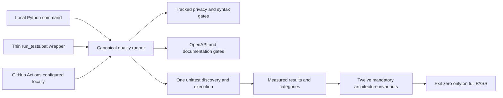

# U07 — Unified Quality Gates & CI

2026-09-24 · **Local quality gate PASS. Unified runner and architecture fitness IMPLEMENTED. Workflow CONFIGURED LOCALLY. Remote GitHub Actions NOT YET VERIFIED.**

## Protected baseline and problem

Branch: `certification/architecture-upgrade`; clean pre-build HEAD/U06: `a6a65c8b2ea0bd7c39fcfb2beff716ae58b71e9a`. U06 ancestry is retained, along with U04 `5223de98daee53f606623a16d867835599cbd9f5`, U03 `1c619259691f5ddca232f1d67142bdf14c0be47b`, baseline tag `v0.4.2-certification-baseline` at `e34624462fa8ef3cdf56e29ce64cab24aac61411` and `v0.5.0-architecture-upgrade` at `32a3d8f286cac2acbb27069a19e65055dacc1d74`. No new branch, tag change, rewrite, amend, rebase, push or merge.

U06 evidence was split: 171 standard unittest tests plus eight plain functions invoked separately. BAT discovery silently omitted those eight; syntax, privacy, OpenAPI and documentation checks were separate manual commands, with no CI workflow. Passing one command therefore did not prove all the accumulated invariants.

## Implemented command and topology

Canonical command: **`python scripts/run_quality_gates.py`**. [Reference](QUALITY_GATE_REFERENCE.md) defines prerequisites, gates, invariant IDs, categories, isolation, exit behavior and maintenance.

The eight organization-source functions are now eight `OrganizationSourceTests` methods with the same classifier and source-policy assertions, expressed as unittest assertions. No previous test was deleted, skipped or weakened. New top-level plain test functions, undiscovered modules, duplicate/empty discovery and category registration drift fail the runner. It uses measured result callbacks, not a hardcoded total; absent/skipped/failing fitness evidence cannot pass. A simulated failing gate confirms nonzero exit and prevents dependent actions. Subtest failure/skip bookkeeping is verified with tiny synthetic suites, not recursive repository runs.

## Architecture and safety gates

The [FITNESS registry](../../scripts/run_quality_gates.py) connects DB version/idempotency, immutable historical snapshots, incomplete/current exclusion, AI port/adapter separation, resilience composition/determinism, canonical API, loopback/remote denial, ignored/untracked artifacts and U06 UI rendering to actual tests. All **12 mandatory fitness functions** are evaluated from the same test run; they do not inflate the automated test count or execute the suite twice.

Sensitive paths and the U06 secret guard use Git tracked metadata; local untracked user files do not cause failures or get scanned. Source signatures and archive entry names remain a bounded scan, not full-history/binary secret certification. No real secret was found by the bounded guard. Findings print file/category only. Guards do not delete data or rewrite history.

`compileall` uses temporary cache storage; critical imports are protected from startup/DB/network/browser side effects. OpenAPI is parsed as YAML and JSON, checked with the FastAPI structural model and compared exactly with runtime export. U04 tests retain coverage of routes, methods, path parameters, operation IDs, frontend call sites and security truth. No external validator or automatic contract rewrite is used.

Documentation checks now run automatically across certification/ADR/root API/test docs. Existing `file.py:line` links are supported. The maintained README's workstation path was removed; exact original audit locations remain explicitly grandfathered. Relative links, file existence/containment, absolute paths and fences are checked. Mermaid has structural checks only: **formal parser/render NOT AVAILABLE**; no Node rendering stack was installed.

## Local evidence

Initial complete successful canonical run: **8.565 seconds**, including **191 tests in 6.990 seconds**. Seven of seven gates passed, all 12 fitness invariants passed, exit code 0. Timings are local observations, not an SLA; later review runs print their own measured duration.

| Automated category | Count | Result |
|---|---:|---|
| U06 privacy/security | 31 | PASS |
| U04 API contract/in-process integration | 23 | PASS |
| U03 snapshots/data | 34 | PASS |
| U09 resilience | 25 | PASS |
| U05 AI provider | 26 | PASS |
| U02 migration/data | 14 | PASS |
| Existing unit/regression | 18 | PASS |
| Formerly separate organization-source tests | 8 | PASS, now standard discovery |
| U07 governance/fitness helpers | 12 | PASS |
| **Authoritative automated total** | **191** | **PASS, zero failures/skips** |

CI-001–008 cover complete discovery, nonzero failure, synthetic tracked artifacts, permitted `.gitkeep`, broken/valid relative links, mandatory fitness registration/execution evidence and measured summaries. Additional helpers cover adapter business isolation, documentation portability/fences, workflow/BAT delegation and synthetic OpenAPI drift. The initial sleep guard rejected AnyIO's zero-delay scheduler checkpoint; it was corrected to allow `asyncio.sleep(0)` while forbidding positive async delays. Runtime application code and U02–U06/U09 semantics remain unchanged.

All DB/import/backup/diagnostic/profile tests use temporary roots and synthetic records. Existing mocked provider/browser/network boundaries remain active. No external network, real VK/LM Studio/Chromium, application startup or real sleep was used by the mandatory suite. No user files were deleted. The real database was read only for pre/post integrity hashing: SHA256 `0c20c00abed8fae1d154db1c0f04a45ba2512dfdd6f6c3d5e440422e5d459652`, unchanged. No login session/profile was accessed.

## CI/runtime decision

[Workflow](../../.github/workflows/quality-gates.yml): PRs and pushes to `main`/`certification/architecture-upgrade`, one `windows-2022` job, Python **3.13.2**, Node **22.14.0**. Windows is selected because device-name/path/reparse behavior and local evidence are Windows-based. No unsupported platform/version matrix is claimed. `requirements-dev.txt` reuses unchanged `requirements.txt` and adds only **PyYAML 6.0.3**, already available locally, for mandatory YAML parsing. No browser binaries, npm dependencies, external validator or SaaS integration are installed for the tests.

Actions checkout/setup and pip installation need dependency network access, but tests need no external network or app secrets. Checkout uses only the built-in read-only token, without persisted credentials. No artifacts/data are uploaded. CI invokes the canonical runner exactly once rather than duplicating gates in YAML.

**Remote GitHub Actions verified: NO.** No push/run was performed. **Branch protection: NOT CONFIGURED.** Recommendation: require PRs and the Quality Gates status on `main` after an actual first remote run. No GitHub API/settings calls were made.

## Documentation, files and limitations

New files: runner, documentation checker, workflow, minimal dev requirements, U07 helper tests, this report and the quality reference. Updated files: BAT wrapper, organization-source tests, README, test plan/acceptance checklist, certification README/status/patterns/C4/evolution/traceability/NFR/debt/backlog/checklist. Application runtime, database schema, static UI and canonical OpenAPI remain unchanged.

AUTOMATED means executable Python/Node checks; MANUAL means live UI/login/provider walkthroughs not run here; DOCUMENTED_ONLY means Markdown target cases, including unimplemented RAG/Graph/Export/Scheduler. Marker tests are not full DOM parsing or live browser certification. Fitness is scoped to tested behavior/imports and identified adapter business fields, not arbitrary semantic proof. Documentation checks do not validate external URLs/heading anchors or formally render Mermaid. Existing transient dependency ranges are not a complete lock. Remote CI and branch settings remain unverified/unconfigured.

U07 makes local architectural evidence repeatable and binds the same checks to a reviewable workflow. The source-safety gate retains protected history and excludes runtime artifacts. One atomic commit: **`chore(ci): add unified architecture quality gates`**; its parent is the U06 start SHA. Commit identity is provided in the final console report.

**Next recommendation only: U08**, a narrow evaluated local retrieval scenario if RAG remains in the accepted scope; no U08 work begins in this change. First remote workflow observation and branch-protection configuration remain user-controlled follow-up actions.
