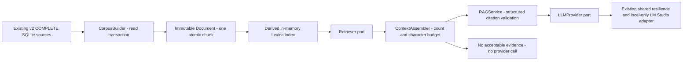

# U08 — Evaluated local RAG implementation report

2026-09-24 · **IMPLEMENTED — STRUCTURED_RAG—LEXICAL** · internal Python service/use case; no API or frontend change.

## Baseline and source safety

Branch: `certification/architecture-upgrade`. Clean start SHA: `550bf894559744446e87ca52830843eb12157285` (U07). U07 ancestry and protected tags were checked before work. Protected commits U03 `1c619259691f5ddca232f1d67142bdf14c0be47b`, U04 `5223de98daee53f606623a16d867835599cbd9f5`, U06 `a6a65c8b2ea0bd7c39fcfb2beff716ae58b71e9a` remain in history. This report belongs to the atomic `feat(ai): add evaluated local RAG` commit; its SHA is available from Git, avoiding a self-referential commit hash.

| Protected tag | Commit |
|---|---|
| v0.4.2-certification-baseline | e34624462fa8ef3cdf56e29ce64cab24aac61411 |
| v0.5.0-architecture-upgrade | 32a3d8f286cac2acbb27069a19e65055dacc1d74 |
| v0.6.0-certification-ready | 550bf894559744446e87ca52830843eb12157285 |

No user DB migration, live provider/VK/browser invocation, index file, profile access, push or merge. User DB pre-build and post-test SHA-256 match: `0c20c00abed8fae1d154db1c0f04a45ba2512dfdd6f6c3d5e440422e5d459652`. Tests use isolated temporary databases/storage and synthetic fixtures. No runtime dependency was added. Prior U07 GitHub Actions success is reported by the owner in the build prompt; this U08 revision has not been pushed or remotely verified. Repository settings are unchanged.

## Choice and boundaries

Repository dependency/model inventory did not provide an installed offline embedding runtime/model. A stdlib lexical index demonstrates query-dependent retrieval with measurable evidence. BM25 is compared with raw term-frequency ranking and bounded by conservative all-token eligibility. **No embeddings, vector store, hybrid fusion, RRF, reranker or Advanced RAG claim.**

Code: [models/ports](../../app/rag/models.py), [builder](../../app/rag/corpus.py), [retriever](../../app/rag/retrieval.py), [service/context](../../app/rag/service.py), [composition](../../app/ai/composition.py), [evaluation](../../app/rag/evaluation.py). RAGService imports contracts/ports only, without concrete retriever, LMStudioProvider or httpx. Structural FakeRetriever/FakeLLM substitution is tested. Existing AIInsightService remains fixed-context and unchanged.

## Persisted corpus and identity

| Document type | Persisted fact | Stable identity / provenance |
|---|---|---|
| snapshot | COMPLETE capture time/precision, relation, declared member count including zero | snapshot UUID; snapshots table/id |
| membership | frozen snapshot_people name and relation membership at capture | snapshot UUID + namespaced external_key; table/composite key |
| event | compatible persisted snapshot_events pair addition/removal, historical projected name | from/to UUIDs + event_type + external_key; table/pair/type/key/projection |

One short fact equals one document; chunk ID appends `:chunk:0`. IDs are `rag:v1:<type>:<sha256>` of canonical source identity, not list position, content or derived event autoincrement IDs. Event identity survives row recreation; replaced source pairs yield different IDs and obsolete edges disappear on rebuild. Captured_at for an event is the destination capture; content states the observation interval is not the exact action time/reason. Metadata includes source_id, snapshot_id, capture precision, relation/person key, provenance and score. Date filters apply to capture date (destination for events).

Builder reads within a SQLite savepoint, requires schema v2 and performs no source writes or migration. COMPLETE-only rules exclude partial/failed/creating observations. Frozen names replace mutable people rows. Snapshot source references, profile/avatar URLs, legacy unknown events, message_stats, collector_dialogs, ai_insights, diagnostics and browser/session data are excluded. No message text/history is fabricated. COMPLETE means declared source completeness, not independent verification that VK disclosed everything.

Repeated ingestion yields identical IDs/content/version and no duplicates. Conflicting duplicate identities fail explicitly. Index rebuild replaces documents, postings, frequencies and metadata fingerprint; it is derived in RAM, never source truth. No index persistence requires a new ignore rule. A service keeps its construction-time corpus; obtain a new service after imports/repairs. There is no automatic refresh or background ingestion.

## Retrieval, context and result

Unicode NFKC/casefold tokenization, small English/Russian stopwords/aliases and inverted postings select facts containing **all informative query terms**. BM25 k1=1.2/b=0.75 uses corpus-wide document frequencies/length normalization. Filters for source_type, snapshot_id, person_key, relation_type and captured_date apply before top-k. Top-k defaults to 3, accepts integers 1–10; queries accept 1–1000 characters. Scores descend, stable IDs settle ties. Unsupported terms conservatively abstain; token overlap is not semantic proof.

Context preserves rank, deduplicates source_type/source_id, excludes nonpositive/nonfinite scores and includes whole facts within default five-evidence/10,000-character JSON limits (hard caps 10/20,000). Oversized facts are skipped. This is a character budget, **not** a tokenizer-specific context-window guarantee. Question size is separately bounded; fixed instructions add overhead.

No accepted evidence returns `INSUFFICIENT_EVIDENCE` with empty answer/evidence_ids/evidence/inferences before model discovery/generation. With evidence, the configured model or existing model-list port is used; structured output requests temperature zero. Existing shared U09 resilience and U06 loopback-only policy are reused. No models available produces a normalized provider failure.

Result: status, answer, evidence_ids, evidence (metadata/content/score), separately labelled inferences. Response schema constrains IDs to context; independent local validation checks exact fields/types/status/size, rejects duplicate/unknown/nonretrieved citations and requires nonempty cited text for GROUNDED. Insufficient responses must have empty answer/citations/inferences. Normalized provider failures propagate; validation errors expose safe categories, not payloads. No answer persistence or logging is added.

## Injection, privacy and limits

Question/evidence are JSON-encoded and delimited as untrusted data. System instructions forbid obeying embedded commands, inventing message history/causes or executing links/code. A synthetic malicious name exercises this path. No tools, subprocess execution or URL fetching exist in the pipeline.

This is **not perfect prompt-injection prevention**. Delimiters/schema constraints cannot prove model obedience or prose entailment. A valid retrieved citation may accompany an incorrect assertion; inline prose citations are not independently parsed. GROUNDED means structurally cited observations, not verified truth. FakeLLM tests validate mechanics, not live quality. Names/person keys remain personal data in memory/local inference; omitting paths/URLs is minimization, not anonymization. RAG modules do not log query/evidence/answer contents. Existing no-auth/no-encryption and third-party logging limitations remain.

## Internal entry point and API decision

`app.ai.composition.get_rag_service()` opens the existing DB with SQLite `mode=ro`, builds corpus/index and binds existing provider/settings. Missing/uninitialized DB fails without creation/migration. Callers use `service.answer(query, top_k=3, filters=Filters(...))`; this is an internal use case, not a CLI/HTTP resource. Building performs no LLM call; ordinary evidence-backed answering invokes the local provider. Tests substitute that provider and DB path.

No RAG endpoint is added because sessions/chat UI and their product contract exceed this increment. Existing 30 app operations, 29 public operations, 21 frontend calls and canonical OpenAPI remain unchanged; U04 drift/contract tests pass. No frontend changes. Person Insight remains compatible. Full FR-8 pipeline and FR-9 chat remain incomplete.

## Evaluation and performance

[Evaluation details](RAG_EVALUATION.md): 18 synthetic cases, 13 answerable / 5 unsupported; corpus 19 documents. BM25 **Recall@3 1.000, MRR 1.000, no-evidence accuracy 1.000**. Thresholds **0.90 / 0.90 / 1.00**, PASS. Term-frequency baseline **1.000 / 1.000 / 1.000**; no measured improvement. Coverage includes exact/history/same-day/empty/timeline/ambiguity/filter/malicious cases. Messages are excluded; message questions must abstain in the fixture.

Initial complete canonical-run sanity: 5,000 synthetic documents, build **47.408 ms**, median selective retrieval **0.011 ms** (25 queries). No SLA, live model timing or large-corpus capacity claim. This small fixture is a regression baseline, not a held-out generalization study.

## Quality and architecture fitness

Canonical `python scripts/run_quality_gates.py`: **222 discovered/executed/passed tests**, zero failures/skips; **7/7 gates and 18/18 fitness invariants PASS**. Initial U08 full run: 11.637 seconds overall, tests 9.980 seconds. Later safety runs print their own duration. Counts remain discovery-driven; fitness reuses recorded outcomes.

| Category | PASS |
|---|---|
| U02 migration | 14 |
| U03 snapshots | 34 |
| U04 API | 23 |
| U05 provider | 26 |
| U06 privacy | 31 |
| U07 governance | 12 |
| U08 RAG | 31 |
| U09 resilience | 25 |
| Existing unit/regression | 26 |
| Total | 222 |

| Fitness | Evidence in test_rag.RAGTests |
|---|---|
| FITNESS-RAG-001 | test_rag_service_depends_on_ports |
| FITNESS-RAG-002 | test_index_is_derived_rebuildable_and_conflicts_fail; test_rebuild_removes_obsolete_derived_edges |
| FITNESS-RAG-003 | test_no_evidence_bypasses_all_llm_calls |
| FITNESS-RAG-004 | test_citations_constrained_to_retrieved_context; test_structured_output_validation |
| FITNESS-RAG-005 | test_evaluation_thresholds_and_baseline |
| FITNESS-RAG-006 | test_eval_fixture_synthetic_only |

[Tests](../../tests/test_rag.py) also cover source immutability, event IDs, empty corpus, ties/rebuild, provenance, context budgets, fake-only context, provider abstention/errors, readonly composition, insight compatibility, metric arithmetic and performance sanity. Existing workflow picks up U08 through the same command. No live dependency or optional regression check is introduced.

## Certification outcome and residual work

ADR-006 is implemented to **STRUCTURED_RAG—LEXICAL** only. Corpus/query retrieval/evidence/evaluation now have executable proof while prior gates/history remain preserved. Remaining work: harder independent labels/paraphrases, optional semantic retrieval with offline assets/measured benefit, API/UI chat, model/prose grounding evaluation, automatic refresh, broader immutable message corpus and measured end-to-end NFR. Next recommendation only: U10 parser strategies; U11 NFR and U17 retrieval evolution remain separate. No next increment starts automatically.
