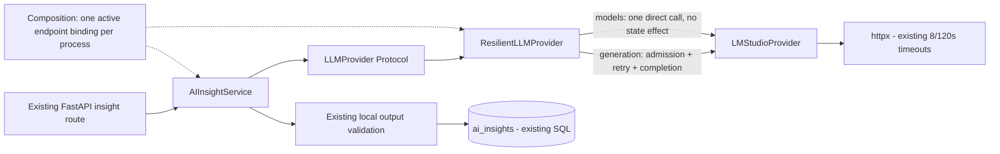
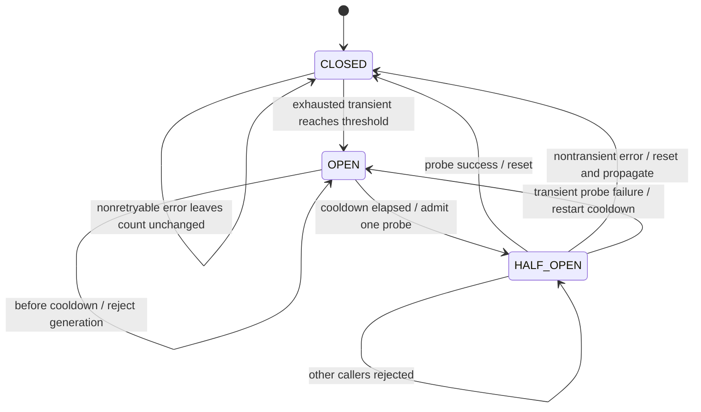

# U09 — LLM Resilience Report

2026-09-23 · **IMPLEMENTED within the U09 build scope**. Evidence is deterministic local behavior/API tests, not a live LM Studio availability or latency benchmark.

## Provenance and build gate

- Branch: `certification/u09-llm-resilience`; initial worktree clean.
- Start/U05 SHA: `2bf48476b396542fde83b3a8c87f27d4cbf2b335`.
- U02: `894e86b4d34268cc609db870d7e7ed099a4be395`.
- Protected tag `v0.4.2-certification-baseline`: `e34624462fa8ef3cdf56e29ce64cab24aac61411`.
- Exact branch, HEAD/log, tag and U05 ancestor gate passed before editing. Previous milestones are retained; no amend/rebase/push/merge.
- Commit message: `feat(ai): add bounded LLM resilience`. The resulting commit is identifiable with `git log -1 --format=%H -- docs/certification/U09_LLM_RESILIENCE_REPORT.md`.

## Problem and before

[U05](U05_LLM_PROVIDER_REPORT.md) established the vendor-neutral provider port, LM Studio adapter, normalized errors, AI-boundary DIP and local structured-output validation. Each adapter request was a single HTTP attempt with an 8 s models or 120 s generation timeout. Transient outages immediately failed the insight operation; repeated user requests could repeatedly wait on an unavailable dependency. No retry policy, delay/jitter policy or stateful breaker existed.

U09 adds recovery for selected transient generation failures and an outage gate across API requests. It does not change prompts, person context, insight validation, SQLite schema/persistence logic, endpoint shapes, settings keys or frontend.

## Architecture and runtime wiring



[Composition](../../app/ai/composition.py) actually constructs and retains `ResilientLLMProvider(LMStudioProvider(base_url))`. A factory lock ensures simultaneous requests share the binding. Endpoint URLs have trailing slashes removed as before; changing the endpoint replaces the binding. Model/temperature changes retain its circuit state. Only one active endpoint binding is retained, with no result cache or unbounded registry. Restart resets state; multiple processes would have independent circuits.

[AIInsightService](../../app/ai/service.py) still depends on the port; it imports neither httpx, the adapter nor resilience implementation. The wrapper imports no transport, FastAPI, domain service or database. The adapter owns HTTP mapping and normalization only, with no retry loop or breaker. FakeProvider works structurally without adapter inheritance. Global DIP remains PARTIAL because SQL persistence is still direct.

## Retry classifier and policy

The classifier uses normalized types, not exception text. Only `ProviderUnavailableError` and `ProviderTimeoutError` are retryable and qualify as infrastructure failures. Exact adapter mapping:

| Condition | Normalized category | Retry / breaker qualification |
|---|---|---|
| httpx timeout | ProviderTimeoutError | yes |
| NetworkError, ProxyError | ProviderUnavailableError | yes |
| HTTP 429, 500, 502, 503, 504 | ProviderUnavailableError | yes |
| Other HTTP status failures, including ordinary 4xx and 501/505 | ProviderProtocolError | no |
| Invalid URL, unsupported protocol, protocol errors, remaining RequestError | ProviderProtocolError | no |
| Invalid HTTP JSON/encoding/envelope/completion shape | ProviderResponseError | no |
| Invalid request/config/model rejected through protocol errors | ProviderProtocolError or local validation error | no |
| Successful generation containing invalid JSON or invalid insight fields | existing InsightValidationError outside wrapper | no; never persisted |
| OPEN or another active HALF_OPEN probe | LLMCircuitOpenError | no; zero underlying generation calls |
| Unexpected exceptions or cancellation | propagated unchanged | no; probe released, no infrastructure increment |

Unavailable mapping was narrowed from all 5xx/all remaining RequestError to the explicit categories above. Errors have safe generic text; no response body, URL, prompt or person data is included. HTTP 429 uses the same bounded full-jitter policy; Retry-After is not interpreted in this increment.

`ResiliencePolicy` is a frozen dataclass, configurable internally and overridable in tests. No UI/configuration keys or dependencies were added.

| Field | Default | Meaning |
|---|---:|---|
| max_attempts | 3 | initial call + at most two retries in CLOSED |
| base_delay | 0.5 s | first exponential ceiling |
| max_delay | 2.0 s | ceiling cap for any retry |
| jitter | full | uniform sample across [0, ceiling] |
| failure_threshold | 3 | exhausted transient logical operations, not HTTP attempts |
| recovery_timeout | 30.0 s | monotonic cooldown before probe admission |

Counts must be positive integers, durations finite and nonnegative, recovery positive and max_delay at least base_delay. Unsupported jitter strategies are rejected. Runtime defaults are conservative explicit engineering choices, not measured optimal values or accepted operational SLOs.

## Exponential backoff and jitter

For retry index `k = 0, 1, …, N−2`:

`ceiling(k) = min(max_delay, base_delay × 2^k)`

`sleep(k) = injected_random_in_[0,1] × ceiling(k)`

Production uses stdlib `random.random`, `time.sleep` and `time.monotonic`; tests inject deterministic sources. Values outside the finite [0,1] random contract are rejected; zero delay does not call the sleeper. No sleep occurs after success, a non-retryable error, final exhaustion, OPEN rejection or the single HALF_OPEN probe.

With default N=3, ceilings are `[0.5, 1.0]` seconds, so theoretical maximum retry sleep is **1.5 s**. A six-attempt test demonstrates the cap with `[0.5, 1.0, 2.0, 2.0, 2.0]` using random=1. Injected 0, 0.25, 0.5 and 1 demonstrate exact scaled delays and bounds. Production full jitter is randomized; reproducibility is provided through injection in tests.

## Timeout/deadline and NFR impact

**Total deadline enforced: NO.** LM Studio retains models=8 s and generation=120 s httpx timeout settings. These are per-phase/inactivity controls, not an upper bound on full response or use-case duration. Progressing reads and multiple phases can extend wall time beyond the scalar setting. U09 does not cancel in-flight work to impose a deadline.

Maximum attempts per admitted CLOSED logical operation: **3**. Maximum configured retry sleep: **1.5 s**. The simple calculation `3 × 120 + 1.5 = 361.5 s` would apply only if each full attempt were independently capped at 120 s; that assumption is not enforced. It is **not** a guaranteed elapsed-time bound. Auto-model discovery adds one 8 s timeout setting (scalar illustration 369.5 s, likewise not a hard bound). HALF_OPEN has one underlying attempt and zero retry sleep.

Three sequential exhausted default logical operations can produce nine generation attempts and at most 4.5 s of configured retry sleep before opening the circuit. OPEN rejects new generation immediately until recovery eligibility. Already admitted concurrent operations can finish their own bounded retry loops after another operation opens the circuit. Lock contention, scheduling and transport time are not included in the sleep budget.

Retries may repeat server inference after a client timeout even if the original server work continues; no exactly-once inference guarantee is claimed. The service still persists only one validated result per successful logical insight request. Performance measurement, actual total deadlines and safe operational telemetry remain U11; see [NFR baseline](NFR_BASELINE.md).

## Circuit state machine and retry interaction



The breaker surrounds the logical retry operation, so an initial transient failure followed by success contributes **zero** failures. Exhausted N attempts contribute **one** failure. CLOSED counts qualifying failures in completion order; success resets the count. Non-retryable CLOSED errors are neutral: they neither increment nor reset the qualifying count.

OPEN raises the distinct port-level `LLMCircuitOpenError` before calling generation. At elapsed time >= recovery_timeout, the first caller atomically enters HALF_OPEN. It performs exactly one underlying attempt, without retries or backoff. A transient probe failure reopens and restarts the timer; success closes/reset. Non-transient probe errors do not establish an infrastructure outage, so they close/reset and propagate their original error. This explicit policy prevents a bad model/request or malformed response from leaving an infrastructure breaker permanently stuck. Unexpected exceptions/cancellation also release the probe without counting an outage.

## Concurrency and lifetime

A stdlib Lock protects admission, state, counter, timestamp and epoch changes; HTTP and sleep occur outside it. While a HALF_OPEN probe is active, all other generation callers fail fast. Epoch tickets ensure a late completion from an older CLOSED cohort cannot close or reopen a newer circuit. No global serialization of normal generation, bulkhead, queue, background recovery worker or distributed lock was added.

Recovery is lazy: after the cooldown, a new call triggers the probe. Merely reading `state` does not change OPEN to HALF_OPEN. Concurrent tests use Events and futures to hold/release a probe deterministically; event/future timeouts are deadlock guards, not real sleeps or timing-based state assertions.

## Models/health and API compatibility

Generation is protected; `list_models` deliberately makes one direct adapter call with its existing 8 s timeout and never changes generation state. Models/connection-test requests neither open a healthy generation circuit nor close an OPEN one. This keeps cheap discovery separate from inference health.

If no model is configured, the unchanged service discovers a model **before** calling generate. Consequently an OPEN insight operation may still make one models request in auto-selection mode, while underlying generation calls remain zero. With an explicit model, the OPEN API test proves zero underlying calls of either kind. A discovery failure can be returned before the generation gate in auto-selection mode. No claim is made that OPEN prevents all discovery HTTP traffic.

Existing routes, success payloads, settings and frontend are unchanged. The current insight error handler returns HTTP 503 with `detail`; OPEN text is `Не удалось получить анализ: LLM generation temporarily unavailable`. It exposes no counter, stack trace, prompt or response data. Models/test/settings remain compatible while generation is OPEN. No cloud/model switch, cached stale response or fabricated success is used.

## Observability and privacy

No existing AI event pipeline warranted a new logging subsystem. No logs, metrics endpoint, telemetry or monitoring platform were added. Lock-protected internal `state`/`failure_count` properties support inspection/tests; they are not new API fields. Existing normalized API failures remain the user-visible signal. U11 safe events/metrics remain planned.

No additional user fields are sent and no prompt/response/person/session content is logged. Arbitrary configured remote endpoints remain the existing U06 debt. Tests use synthetic records, temporary databases, FakeProvider and httpx.MockTransport; no live LM Studio, VK or Chromium is started.

## Test evidence

[New tests](../../tests/test_llm_resilience.py): **25 tests PASS**, with subtests covering additional category/value cases. Requirement IDs may share one method; they are not counted as separate test executions.

| Required evidence | Behavior proved | Result |
|---|---|---|
| RES-001 / CB-008 | transient then success, two calls, healthy breaker | PASS |
| RES-002 / CB-009 | exactly max_attempts, final normalized error identity, one logical failure | PASS |
| RES-003 | non-retryable protocol/response/validation/config/circuit error: one call, no sleep | PASS |
| RES-004 | exact exponential delay sequence with cap | PASS |
| RES-005 | injected full-jitter values and sleep bounds | PASS |
| RES-006 | normalized timeout retries and recovers | PASS |
| RES-007 | invalid generated JSON/structured output: no retry, no SQLite insertion | PASS |
| CB-001 | threshold opens after failed logical operations | PASS |
| CB-002 | OPEN adds no provider calls/retries/sleeps | PASS |
| CB-003 / CB-004 | fake clock 29.99/30s boundary, successful single probe closes/resets | PASS |
| CB-005 | failed probe is one attempt, reopens/restarts cooldown | PASS |
| CB-006 | CLOSED success resets qualifying failure streak | PASS |
| CB-007 | non-retryable CLOSED neutral, HALF_OPEN closes/reset without outage count | PASS |
| CB-010 | simultaneous HALF_OPEN callers allow only one underlying probe | PASS |
| RES-API-001 | transient recovery through actual composition/API; one persisted insight | PASS |
| RES-API-002 | retained OPEN binding returns controlled 503 with zero underlying calls for selected model | PASS |
| RES-API-003 | fake cooldown/probe restores following API requests | PASS |
| RES-API-004 | models/test/settings compatibility while OPEN | PASS |
| Additional | selected HTTP statuses; models neutrality; policy validation; stale CLOSED completion; concurrent binding construction; auto-model caveat | PASS |
| Architecture fitness | service→port, wrapper vendor-neutral, adapter→httpx; composition wraps real adapter and shared state | PASS |

## Regression gate and reproduction

Executed locally in the existing Python 3.13.2 virtual environment, with unchanged requirements:

```powershell
.\.venv\Scripts\python.exe -B -m unittest discover -s tests -p test_llm_resilience.py -v
.\.venv\Scripts\python.exe -B -m unittest discover -s tests -p test_ai_provider.py -v
.\.venv\Scripts\python.exe -B -m unittest discover -s tests -p test_migrations.py -v
.\.venv\Scripts\python.exe -B -m unittest discover -s tests -v
.\.venv\Scripts\python.exe -B -c "import runpy; ns=runpy.run_path('tests/test_v043_organization_source.py'); tests=[(n,f) for n,f in ns.items() if n.startswith('test_') and callable(f)]; [f() for _,f in tests]; print(f'{len(tests)} additional existing tests PASS')"
```

| Suite | Count | Result |
|---|---:|---|
| New U09 | 25 | PASS |
| U05 provider/validation/API | 26 | PASS |
| U02 migration | 14 | PASS |
| Existing unittest | 18 | PASS |
| Standard discovery total | **83** | **PASS, 0 failures/errors** |
| Additional existing v043 functions | **8** | **PASS** |

The standard runner still omits eight plain functions; unified collection/CI remains U07. Two pre-existing unclosed-file ResourceWarnings in v031 marker tests remain warnings, not failures. No dependency was installed. AI test guards reject real HTTP/socket connection and `time.sleep`; injected sleepers advance only fake time. API tests use temporary DB paths and TestClient without production startup. Existing DB tests retain U02 isolation.

## Files and source safety

- New [resilience.py](../../app/ai/resilience.py): typed policy, classifier, retry/jitter, state machine, locking and injectable time/random.
- [contracts.py](../../app/ai/contracts.py), [provider.py](../../app/ai/provider.py): normalized circuit-open error and updated decorator contract.
- [composition.py](../../app/ai/composition.py): shared runtime binding with endpoint lifecycle.
- [providers/lmstudio.py](../../app/ai/providers/lmstudio.py): selective transient normalization; HTTP mapping/timeouts otherwise preserved.
- New [test_llm_resilience.py](../../tests/test_llm_resilience.py); [test_ai_provider.py](../../tests/test_ai_provider.py) only adapts wrapper expectations, fixture binding isolation and real-sleep guard; all 26 U05 tests retained.
- Ten requested documentation pages updated: Architecture Status, Architectural Patterns, Current/Target C4, Architecture Evolution, NFR Baseline, Traceability Matrix, Technical Debt Register, upgrade backlog and root README. ADR-004 current wiring/evolution notes aligned minimally; historical U05 evidence retained. This report added.

No changes to requirements, frontend, main routes, AI service/prompt/validation/persistence, settings schema, DB/migrations, collector or test runner. No DB/backups/profile/previews/logs/secrets added to the commit. Protected baseline remains fixed and U05 remains an ancestor. User database was not opened through SQLite or migrated; pre/post SHA-256 remains `0c20c00abed8fae1d154db1c0f04a45ba2512dfdd6f6c3d5e440422e5d459652`.

## Limitations, certification value and next upgrade

Retry, Exponential Backoff, Full Jitter and Circuit Breaker are **IMPLEMENTED**, with actual API composition and deterministic failure/concurrency evidence. Provider and AI-boundary DIP remain IMPLEMENTED; global DIP PARTIAL. RAG remains NO_RAG/PLANNED; Ollama and fallback NO. This is a stdlib mechanism scoped to the current synchronous generation port, not a generic resilience framework.

No total deadline, live inference/performance proof, process-shared breaker, result cache, queue, request cancellation or inference idempotency guarantee is claimed. State resets on process restart/endpoint change; discovery is independent; previously admitted work may continue. U11 measurements/telemetry and U06 endpoint policy remain open.

Recommendation only: U03 immutable Snapshot/source integrity is the next foundational implementation step; U07 unified test collection and U11 measured NFR remain separate backlog items. None is started by U09, and the entire target architecture is not declared complete.
