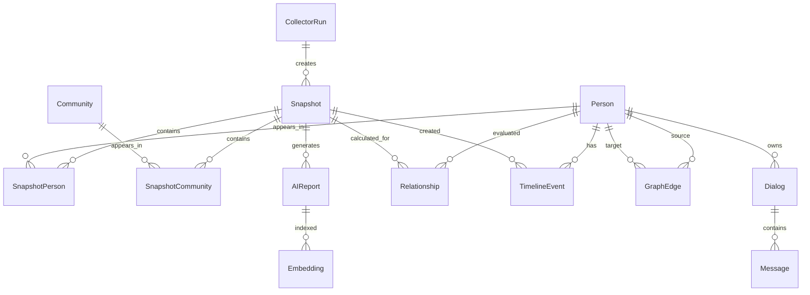

> **Architecture status: TARGET / EVOLUTIONARY DESIGN.**
> This document describes intended architecture and is not evidence that every component is implemented.
> Verified AS-IS: [docs/certification/C4_CURRENT.md](../../docs/certification/C4_CURRENT.md).
> Implementation status: [docs/certification/ARCHITECTURE_STATUS.md](../../docs/certification/ARCHITECTURE_STATUS.md).

# 10_DATA_MODEL.md

# Data Model

**Project:** VK Social Radar

**Version:** 1.0

---

# Overview

Модель данных описывает доменные сущности системы, их атрибуты, ограничения и связи.

Документ является логической моделью предметной области и не зависит от выбранной СУБД.

---

# Entity — Snapshot

## Назначение

Представляет неизменяемый снимок состояния VK в определённый момент времени.

### Fields

| Поле | Тип | Ограничения |
|------|-----|-------------|
| id | UUID | PK |
| created_at | DATETIME | NOT NULL |
| version | INTEGER | NOT NULL |
| collector_version | STRING | NOT NULL |
| status | ENUM | CREATED, FAILED |
| duration_ms | INTEGER | >=0 |
| notes | TEXT | NULL |

### Constraints

- Snapshot неизменяем после создания.
- Один Snapshot содержит полное состояние системы.

---

# Entity — Person

## Назначение

Хранит информацию о пользователе VK.

### Fields

| Поле | Тип |
|------|-----|
| id | UUID |
| vk_id | STRING |
| first_name | STRING |
| last_name | STRING |
| screen_name | STRING |
| avatar_url | STRING |
| profile_url | STRING |
| status | STRING |
| city | STRING |
| country | STRING |
| birth_date | DATE |
| is_deleted | BOOLEAN |
| is_closed | BOOLEAN |

### Constraints

- vk_id уникален.

---

# Entity — SnapshotPerson

## Назначение

Связывает Snapshot и Person.

Позволяет хранить историю изменений профиля.

### Fields

| Поле | Тип |
|------|-----|
| id | UUID |
| snapshot_id | UUID |
| person_id | UUID |
| friend | BOOLEAN |
| follower | BOOLEAN |
| following | BOOLEAN |
| last_seen | DATETIME |
| profile_hash | STRING |

### Constraints

- UNIQUE(snapshot_id, person_id)

---

# Entity — Dialog

## Назначение

Представляет диалог пользователя.

### Fields

| Поле | Тип |
|------|-----|
| id | UUID |
| vk_dialog_id | STRING |
| person_id | UUID |
| title | STRING |
| unread_count | INTEGER |
| pinned | BOOLEAN |
| last_message_at | DATETIME |

### Constraints

- vk_dialog_id уникален.

---

# Entity — Message

## Назначение

Сообщение внутри диалога.

### Fields

| Поле | Тип |
|------|-----|
| id | UUID |
| dialog_id | UUID |
| sender_id | UUID |
| message_date | DATETIME |
| text | TEXT |
| attachments | JSON |
| outgoing | BOOLEAN |

---

# Entity — Community

## Назначение

Сообщество VK.

### Fields

| Поле | Тип |
|------|-----|
| id | UUID |
| vk_id | STRING |
| name | STRING |
| screen_name | STRING |
| type | ENUM |
| members_count | INTEGER |

---

# Entity — SnapshotCommunity

## Назначение

Фиксирует участие пользователя в сообществах на момент Snapshot.

### Fields

| Поле | Тип |
|------|-----|
| id | UUID |
| snapshot_id | UUID |
| community_id | UUID |

---

# Entity — Relationship

## Назначение

Хранит рассчитанные показатели отношений.

### Fields

| Поле | Тип |
|------|-----|
| id | UUID |
| snapshot_id | UUID |
| person_id | UUID |
| relationship_score | DECIMAL |
| interaction_score | DECIMAL |
| stability_score | DECIMAL |
| activity_score | DECIMAL |
| calculated_at | DATETIME |

### Constraints

- Рассчитывается аналитическим движком.
- Не входит в Snapshot.

---

# Entity — TimelineEvent

## Назначение

История изменений.

### Fields

| Поле | Тип |
|------|-----|
| id | UUID |
| person_id | UUID |
| snapshot_id | UUID |
| event_type | ENUM |
| event_date | DATETIME |
| payload | JSON |

---

# Entity — GraphEdge

## Назначение

Связь между двумя пользователями.

### Fields

| Поле | Тип |
|------|-----|
| id | UUID |
| source_person_id | UUID |
| target_person_id | UUID |
| weight | DECIMAL |
| edge_type | ENUM |

---

# Entity — AIReport

## Назначение

Отчёт AI Analyst.

### Fields

| Поле | Тип |
|------|-----|
| id | UUID |
| snapshot_id | UUID |
| created_at | DATETIME |
| prompt_hash | STRING |
| model | STRING |
| report | TEXT |

---

# Entity — Embedding

## Назначение

Векторное представление объекта для RAG.

### Fields

| Поле | Тип |
|------|-----|
| id | UUID |
| entity_type | ENUM |
| entity_id | UUID |
| embedding | VECTOR |
| model | STRING |
| created_at | DATETIME |

---

# Entity — CollectorRun

## Назначение

История запусков Collector.

### Fields

| Поле | Тип |
|------|-----|
| id | UUID |
| started_at | DATETIME |
| finished_at | DATETIME |
| status | ENUM |
| collected_objects | INTEGER |
| error_message | TEXT |

---

# Entity — ApplicationSettings

## Назначение

Настройки приложения.

### Fields

| Поле | Тип |
|------|-----|
| id | UUID |
| key | STRING |
| value | TEXT |

---

# Entity Relationships

---

# Cardinality Summary

| Relationship | Cardinality |
|--------------|-------------|
| Snapshot → SnapshotPerson | 1:N |
| Person → SnapshotPerson | 1:N |
| Snapshot → SnapshotCommunity | 1:N |
| Community → SnapshotCommunity | 1:N |
| Person → Dialog | 1:N |
| Dialog → Message | 1:N |
| Snapshot → Relationship | 1:N |
| Person → Relationship | 1:N |
| Snapshot → TimelineEvent | 1:N |
| Person → TimelineEvent | 1:N |
| Snapshot → AIReport | 1:N |
| AIReport → Embedding | 1:N |
| CollectorRun → Snapshot | 1:N |
