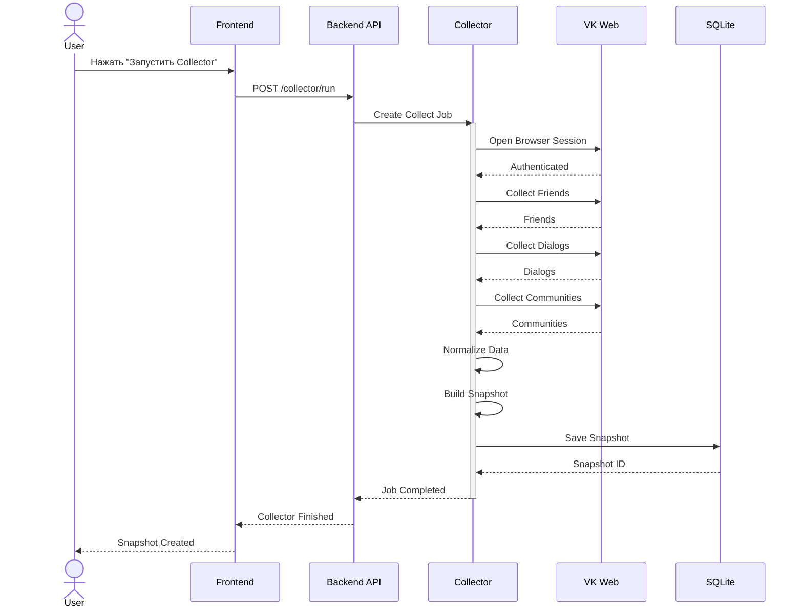
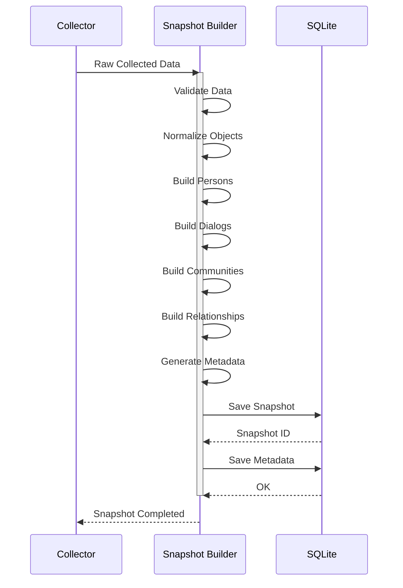
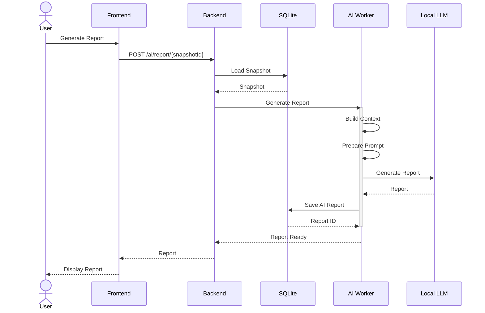
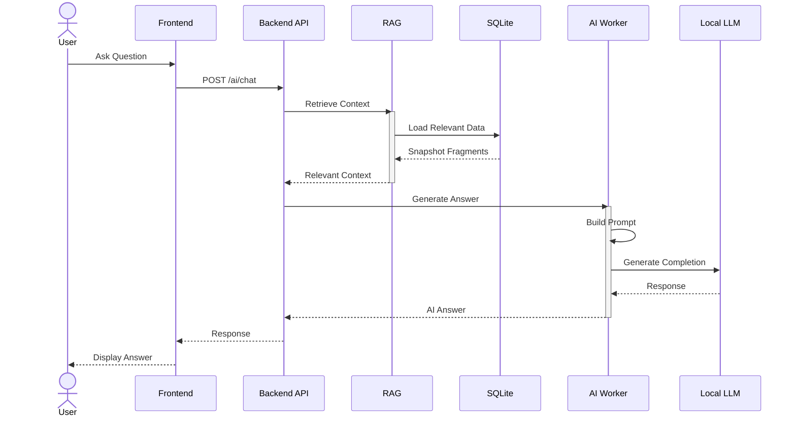
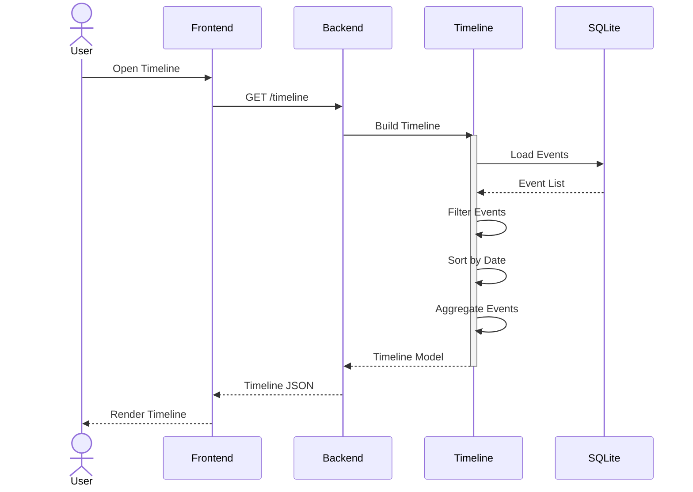
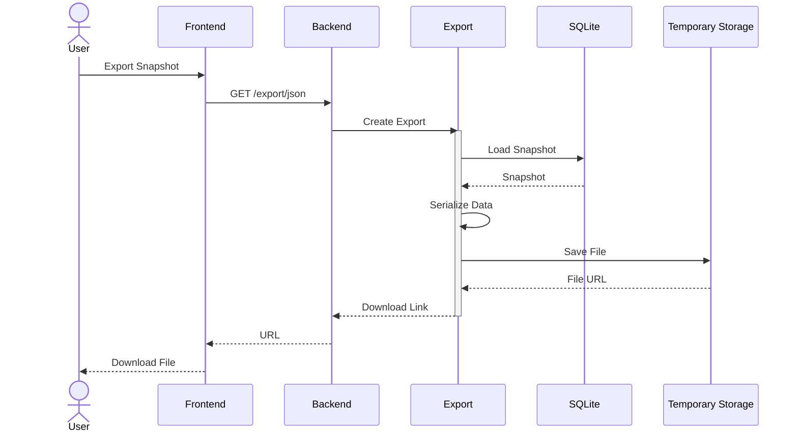
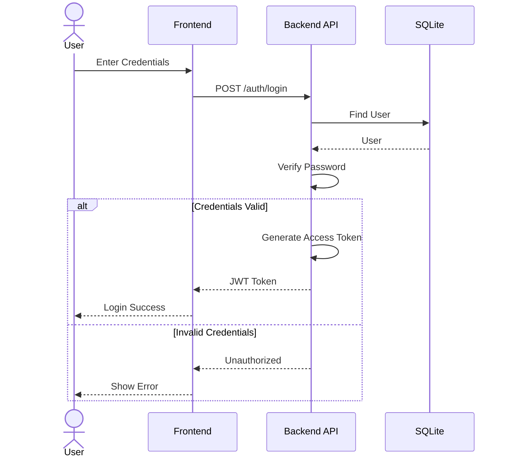
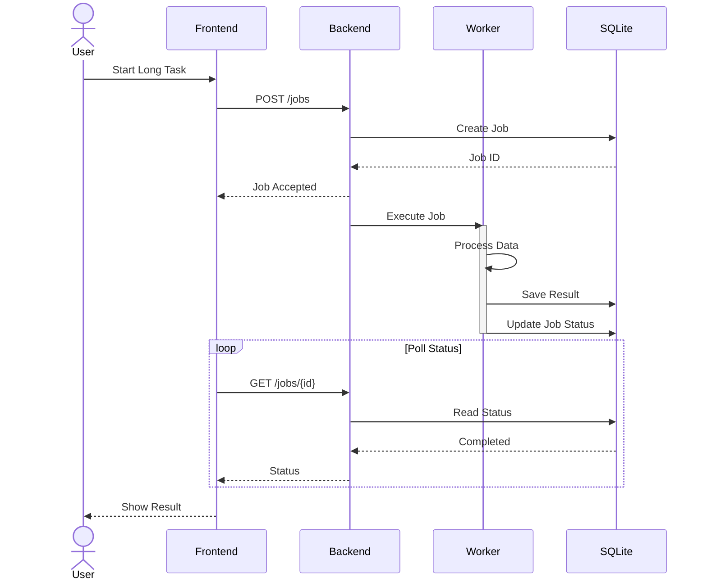
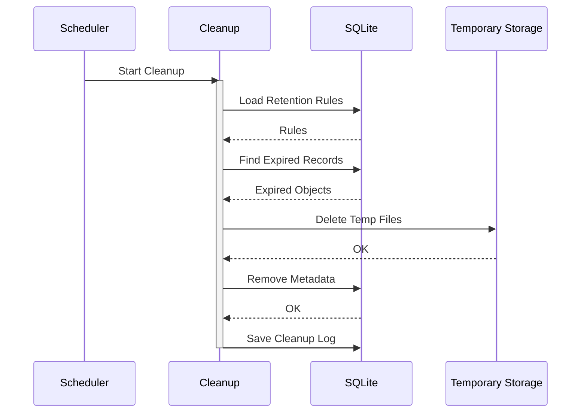

> **Architecture status: TARGET / EVOLUTIONARY DESIGN.**
> This document describes intended architecture and is not evidence that every component is implemented.
> Verified AS-IS: [docs/certification/C4_CURRENT.md](../../docs/certification/C4_CURRENT.md).
> Implementation status: [docs/certification/ARCHITECTURE_STATUS.md](../../docs/certification/ARCHITECTURE_STATUS.md).

# 15_SEQUENCE_DIAGRAMS.md

# Sequence Diagrams

Project: VK Social Radar

Version: 1.0

---

# Purpose

Данный документ описывает последовательность взаимодействия компонентов системы во времени.

Если документы архитектуры отвечают на разные вопросы, то их роли распределяются следующим образом:

| Документ | Назначение |
|----------|------------|
| C4 Architecture | Показывает структуру системы и взаимосвязи компонентов |
| Business Processes | Показывает бизнес-логику и пользовательские процессы |
| Sequence Diagrams | Показывает взаимодействие компонентов во времени при выполнении конкретного сценария |

Sequence Diagram является связующим звеном между бизнес-процессами и технической реализацией.

Все диаграммы используют нотацию **Mermaid sequenceDiagram**, поддерживаемую GitHub, GitLab, MkDocs и большинством современных IDE.

---

# Общие принципы

Во всех сценариях соблюдаются архитектурные принципы проекта:

- Frontend никогда не обращается напрямую к базе данных.
- Backend API является единой точкой входа.
- Collector выполняет только сбор данных.
- Аналитические сервисы работают исключительно с сохранёнными Snapshot.
- AI получает данные только через Backend и слой RAG.
- Snapshot является единственным источником истины (Single Source of Truth).
- Все длительные операции выполняются асинхронно.

---

# 1. Запуск Collector

## Назначение

Запустить процесс сбора данных из VK и сформировать новый Snapshot, не влияя на ранее сохранённые данные.

---

## Участники

- User
- Frontend
- Backend API
- Collector Service
- VK Web
- SQLite Database

---

## Последовательность

1. Пользователь нажимает кнопку запуска Collector.
2. Frontend отправляет запрос Backend API.
3. Backend создаёт новую задачу сбора.
4. Collector Service получает задачу.
5. Collector запускает браузер с пользовательским профилем.
6. Collector выполняет сбор данных из VK.
7. Полученные данные нормализуются.
8. Формируется новый Snapshot.
9. Snapshot сохраняется в SQLite.
10. Collector уведомляет Backend об успешном завершении.
11. Frontend получает обновлённый статус.



---

## Ключевые особенности

- запуск выполняется синхронно только до постановки задачи;
- сбор данных полностью изолирован в Collector;
- Backend не взаимодействует с VK напрямую;
- Snapshot создаётся только после успешного завершения сбора;
- предыдущие Snapshot остаются неизменными;
- Collector является stateless-компонентом;
- при сбое существующие данные не изменяются.

---

# 2. Создание Snapshot

## Назначение

Преобразовать собранные данные в неизменяемый Snapshot, пригодный для последующей аналитики.

---

## Участники

- Collector Service
- Snapshot Builder
- SQLite Database

---

## Последовательность

1. Collector завершает получение данных.
2. Snapshot Builder агрегирует все сущности.
3. Формируется единая модель Snapshot.
4. Создаются связи между объектами.
5. Записываются основные данные.
6. Сохраняются метаданные Snapshot.
7. Фиксируется успешное завершение операции.



---

## Ключевые особенности

- Snapshot строится атомарно;
- все данные проходят нормализацию;
- связи вычисляются до записи;
- запись выполняется только после успешной валидации;
- Snapshot становится неизменяемым после сохранения;
- аналитика никогда не работает с промежуточными данными.

---

# 3. Генерация AI Report

## Назначение

Сформировать аналитический отчёт на основании выбранного Snapshot с использованием локальной языковой модели.

---

## Участники

- User
- Frontend
- Backend API
- AI Worker
- SQLite Database
- Local LLM

---

## Последовательность

1. Пользователь выбирает Snapshot.
2. Frontend отправляет запрос на генерацию отчёта.
3. Backend получает Snapshot.
4. Backend передаёт данные AI Worker.
5. AI Worker формирует контекст.
6. Создаётся системный Prompt.
7. Выполняется запрос к локальной LLM.
8. Полученный отчёт сохраняется.
9. Backend возвращает результат пользователю.



---

## Ключевые особенности

- AI не обращается напрямую к пользовательскому интерфейсу;
- генерация выполняется через выделенный AI Worker;
- отчёт строится только по сохранённому Snapshot;
- используется локальная LLM без передачи данных во внешние сервисы;
- готовый отчёт сохраняется для повторного использования;
- повторный просмотр отчёта не требует повторного вызова модели.

---

---

# 4. AI Chat + RAG

## Назначение

Обеспечить интерактивное взаимодействие пользователя с локальной языковой моделью, используя только релевантный контекст из сохранённых данных проекта.

В отличие от генерации отчёта, AI Chat не анализирует всю базу данных. Он работает через слой Retrieval-Augmented Generation (RAG), который извлекает только необходимые данные.

---

## Участники

- User
- Frontend
- Backend API
- RAG Service
- SQLite Database
- AI Worker
- Local LLM

---

## Последовательность

1. Пользователь задаёт вопрос.
2. Frontend отправляет запрос Backend API.
3. Backend инициирует поиск релевантного контекста.
4. RAG Service извлекает необходимые данные.
5. Backend объединяет вопрос и найденный контекст.
6. AI Worker формирует системный Prompt.
7. Выполняется запрос к локальной LLM.
8. Ответ возвращается Backend.
9. Frontend отображает ответ пользователю.



---

## Ключевые особенности

- Backend не передаёт LLM всю базу данных.
- Используется Retrieval-Augmented Generation.
- В контекст попадают только релевантные данные.
- AI Worker не имеет прямого доступа к БД.
- Все обращения к модели проходят через Backend.
- Ответы могут кэшироваться для повторных запросов.
- Контекст ограничивается текущим Snapshot.

---

# 5. Построение Timeline

## Назначение

Построить хронологическую историю изменений между Snapshot для выбранного пользователя или всей социальной сети.

---

## Участники

- User
- Frontend
- Backend API
- Timeline Service
- SQLite Database

---

## Последовательность

1. Пользователь открывает Timeline.
2. Frontend запрашивает события.
3. Backend вызывает Timeline Service.
4. Timeline Service получает события из базы.
5. Выполняется фильтрация.
6. Выполняется сортировка по времени.
7. Производится агрегация событий.
8. Формируется итоговая структура Timeline.
9. Backend возвращает данные Frontend.



---

## Ключевые особенности

- Timeline формируется динамически.
- Все события основаны исключительно на Snapshot.
- Сервис не изменяет данные.
- Возможна фильтрация по периоду.
- Возможна фильтрация по пользователю.
- Поддерживается пагинация длинных Timeline.
- Все вычисления выполняются сервером.

---

# 6. Экспорт данных

## Назначение

Позволить пользователю экспортировать данные проекта в стандартных форматах без прямого доступа к внутреннему хранилищу.

---

## Участники

- User
- Frontend
- Backend API
- Export Service
- SQLite Database
- Temporary Storage

---

## Последовательность

1. Пользователь выбирает формат экспорта.
2. Frontend отправляет запрос Backend API.
3. Backend запускает Export Service.
4. Export Service получает данные Snapshot.
5. Выполняется сериализация.
6. Создаётся экспортный файл.
7. Файл сохраняется во временное хранилище.
8. Backend возвращает ссылку.
9. Пользователь скачивает файл.



---

## Ключевые особенности

- Экспорт выполняется без блокировки пользовательского интерфейса.
- Формат выбирается пользователем.
- Backend не отдаёт внутренние структуры БД.
- Создаётся отдельный экспортный файл.
- Используется временное хранилище.
- Ссылка может иметь ограниченное время жизни.
- Возможно добавление новых экспортных форматов без изменения Frontend.

---

# Архитектурные замечания

Диаграммы данного раздела демонстрируют ключевой принцип архитектуры VK Social Radar:

- взаимодействие компонентов происходит через Backend API;
- сервисы изолированы друг от друга;
- аналитика работает только с сохранёнными Snapshot;
- AI получает данные исключительно через RAG;
- все длительные операции могут выполняться асинхронно;
- Frontend никогда не взаимодействует напрямую с SQLite или AI Worker.

Во всех сценариях соблюдается принцип разделения ответственности (Separation of Concerns), что позволяет независимо развивать Collector, аналитические сервисы, AI-подсистему и пользовательский интерфейс.

---

---

# 7. Авторизация пользователя

## Назначение

Предоставить пользователю доступ к системе после успешной проверки учетных данных и выдачи токена доступа.

Даже если текущая версия приложения используется локально, сценарий авторизации выделен отдельно, поскольку архитектура предусматривает возможность перехода к многопользовательскому режиму без изменения внутренних компонентов.

---

## Участники

- User
- Frontend
- Backend API
- SQLite Database

---

## Последовательность

1. Пользователь открывает форму входа.
2. Frontend отправляет логин и пароль.
3. Backend проверяет пользователя.
4. Выполняется проверка пароля.
5. Генерируется Access Token.
6. Frontend сохраняет токен.
7. Пользователь получает доступ к приложению.



---

## Ключевые особенности

- Backend является единственной точкой проверки авторизации.
- Пароли никогда не сохраняются в открытом виде.
- Frontend использует только токен доступа.
- Все защищённые методы требуют Bearer Token.
- Архитектура готова к расширению ролями пользователей.

---

# 8. Фоновая обработка задач

## Назначение

Выполнить длительные вычисления без блокировки пользовательского интерфейса.

К таким задачам относятся:

- генерация AI Report;
- пересчёт аналитики;
- построение индексов;
- формирование больших экспортов;
- переиндексация данных.

---

## Участники

- User
- Frontend
- Backend API
- Background Worker
- SQLite Database

---

## Последовательность

1. Пользователь запускает длительную операцию.
2. Backend создаёт задачу.
3. Возвращает идентификатор задачи.
4. Worker получает задачу.
5. Выполняет обработку.
6. Сохраняет результат.
7. Обновляет статус.
8. Frontend периодически опрашивает Backend.
9. Пользователь получает результат.



---

## Ключевые особенности

- Пользователь не ожидает завершения операции.
- Backend остаётся отзывчивым.
- Все задачи имеют собственный жизненный цикл.
- Возможен повторный запуск задачи.
- Возможно отображение прогресса выполнения.
- Архитектура допускает масштабирование Worker без изменения API.

---

# 9. Очистка устаревших данных

## Назначение

Удалить временные данные и неиспользуемые артефакты без нарушения целостности Snapshot.

---

## Участники

- Scheduler
- Cleanup Service
- SQLite Database
- Temporary Storage

---

## Последовательность

1. Планировщик запускает Cleanup Service.
2. Загружаются политики хранения.
3. Определяются устаревшие объекты.
4. Удаляются временные файлы.
5. Удаляются просроченные экспорты.
6. Обновляется журнал очистки.



---

## Ключевые особенности

- Snapshot не удаляются автоматически.
- Очистка касается только временных данных.
- Политика хранения централизована.
- Возможен запуск по расписанию.
- Все действия журналируются.
- Ошибки очистки не влияют на работу системы.

---

# Архитектурные принципы взаимодействия

Все приведённые Sequence Diagram построены в соответствии с едиными архитектурными правилами проекта.

## Единая точка входа

Любое взаимодействие пользователя проходит через Backend API.

```text
User
    │
Frontend
    │
Backend API
    │
Internal Services
```

Это исключает прямой доступ к внутренним сервисам и упрощает контроль безопасности.

---

## Разделение ответственности

Каждый компонент выполняет только собственную функцию.

| Компонент | Ответственность |
|-----------|-----------------|
| Frontend | Пользовательский интерфейс |
| Backend API | Оркестрация запросов |
| Collector Service | Сбор данных VK |
| Snapshot Builder | Формирование Snapshot |
| Timeline Service | Построение истории изменений |
| Analytics Engine | Расчёт аналитики |
| AI Worker | Работа с LLM |
| RAG Service | Подготовка контекста |
| Export Service | Формирование экспортов |
| SQLite | Постоянное хранение данных |

---

## Синхронные операции

Используются только для коротких запросов:

- получение данных;
- поиск;
- чтение Snapshot;
- открытие Timeline;
- получение отчётов.

---

## Асинхронные операции

Используются для длительных вычислений:

- Collector;
- AI Report;
- импорт данных;
- экспорт больших объёмов;
- переиндексация;
- обслуживание системы.

---

## Работа со Snapshot

Все аналитические сервисы используют исключительно сохранённые Snapshot.

```text
Collector
      │
Snapshot
      │
 ├── Timeline
 ├── Analytics
 ├── Graph
 ├── AI
 └── Export
```

Это гарантирует воспроизводимость результатов анализа независимо от изменения данных в VK.

---

## Взаимодействие с AI

Языковая модель никогда не обращается напрямую к базе данных.

Последовательность взаимодействия всегда выглядит следующим образом:

```text
User
   │
Frontend
   │
Backend API
   │
Knowledge Retrieval
   │
AI Worker
   │
Local LLM
```

Такой подход обеспечивает:

- минимальный объём контекста;
- снижение стоимости вычислений;
- отсутствие прямого доступа модели к данным;
- возможность замены LLM без изменения бизнес-логики.

---

# Заключение

Sequence Diagram завершают описание архитектуры VK Social Radar, показывая взаимодействие компонентов во времени.

Совместно с документами:

- PROJECT_PASSPORT;
- SPECIFICATION;
- C4 Architecture;
- Business Processes;
- ER Diagram;
- OpenAPI;
- API Guide;

они образуют полный набор архитектурной документации, достаточный для разработки, сопровождения и дальнейшего развития системы в соответствии с принципами Spec-Driven Development (SDD).